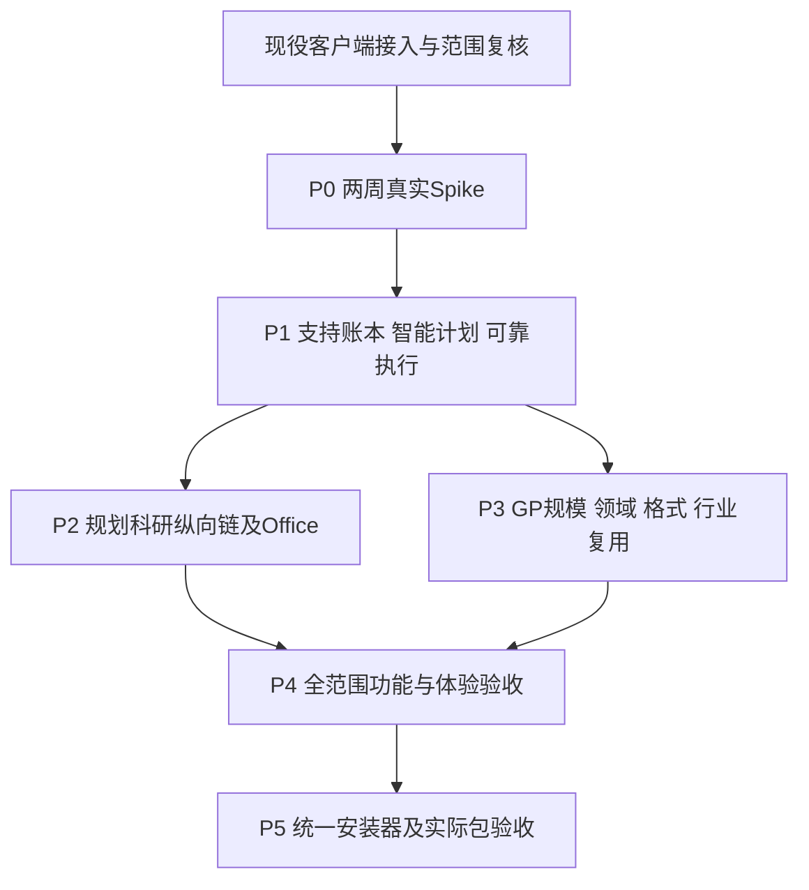

# 模块落点、开发WBS与最终发行计划

日期：2026-10-01。性质：开发建议，执行侧交PASS CANDIDATE；不自行创建D工单、不改现台账、不实施安装/构建/LIVE。配套[总纲](README_FINAL.md)、[智能实现](INTELLIGENCE_AND_ORCHESTRATION.md)。

## 1. 复用实际代码与分层

| 当前基础 | 本版实现落点 |
|---|---|
| `Source/ArcGISProMCP.Compatibility/Composition.cs` | 唯一Registry；稳定底册与可选GP生成入口只在启动构建，绑定固定准入manifest |
| Shared ToolInvoker/Validator | 增加上下文/计划revision/范围/准入与批准引用，所有入口同策略 |
| Shared WorkflowJobStore | 复用lease/fence/日志；补资源队列/输入快照/每动作对账/DeliveryRevision，防旧owner写入 |
| `Source/Shared/ArcGISProMCP.Server/Internal/PsChannelHandler.cs` | 现内部路由上补真实peer、单写、固定业务命令与状态/对账，不新增公网或任意JS入口 |
| `D091PsTools.cs` / `D102PsTools.cs` | 将已注册20接口逐业务实现并读回验证，未实现仍如实拒绝 |
| `Config.daml` / Host服务 | 增Pro DockPane与SDK DTO适配；SDK对象访问遵守MCT，Shared保持无SDK |
| 现素材/符号/布局/质量服务 | FactTable/DesignSpec/字体测量/CheckReport与项目风格，不重写全部GIS服务 |
| 原Benchmarks/资产 | 保持四锚原文；新增智能/格式/项目交接测试独立目录，不能改黄金文件刷绿 |

名称是职责不是要求重命名已有类型。每轮先读最新Source/契约和实际批次范围，发现等价模型优先扩现服务。端口/路径/超时/功能/预算集中Configuration；默认6520/mcp回环、Bridge6511受限，禁止第二注册中心与任意代码旁路。

## 2. 12产品包逐包实现

| 包 | 技术实施 | 本版深化 |
|---|---|---|
| U01 工作台 | WPF/MVVM DockPane＋TaskApplicationService、任务/步骤/预览/成果共id | IntentFrame、集中关键问题、键盘/高DPI与真实错误解释 |
| U02 模型 | Provider接口、ModelProfile、流式TypedProposal、密钥引用/usage | ModelCapabilityProfile/路由策略，模型替换不改变GIS方法或批准 |
| U03 上下文 | D盘持久session＋Host DTO/ContextSnapshot/Delta | 每任务固定上下文、InputSnapshotRef、项目偏好来源与隔离 |
| U04 指代 | @标签/点选/框选＋稳定身份/selection materialization | SpatialQuerySpec组合语义、时间/单位、全集/陈旧检查 |
| U05 可视流程 | AnalysisPlan投影、WorkflowPatch、预检/控制 | 方法选择、FeasibilityReport、有限revision和自主等级；无第二执行器 |
| U06 数据接入 | 现搜索/摘要聚合＋SourceDocumentProfile/ImportPlan | 多sheet/扫描表格/坐标/日期候选与低可信关键项确认 |
| U07 知识 | 本地全文检索优先、可选向量索引、MethodCard/Citation | 可执行EligibilityRule、条款/方法/任务/成果依赖，注入内容无权限 |
| U08 成果 | DeliveryManifest＋Report/Workbook/PresentationSpec和固定文档adapter | 候选交付revision/整体激活，真实原生可编辑性、通知去重 |
| U09 记录 | Invoker/Jobs语义事件＋RecordingGap＋参数草稿 | 操作解释、泛化依据/方法常量保留，非系统动作不假称全录 |
| U10 技能 | 声明式SkillManifest、依赖锁/版本、作者与回放测试 | SkillFitReport/已验映射/有界修复，第二目录接手；不带过去批准 |
| U11 规范 | NormSource→RuleCandidate→Decision→受限RulePack | 已知答案/例外/有效期、规则变化影响，普通用户用已验包 |
| U12 行业 | DomainManifest组合方法/输入/规则/模板/样例/负例/更新 | BP01–BP10深度及各行业入口，CAD/TXT等真实adapter而非自由字符串 |

M01–M20与八领域的完整功能边界见[支持矩阵](CAPABILITY_AND_SUPPORT_MATRIX.md)。U包是产品工作分解，I/R/GA是内部工程分解，不新增28或10个营销工具。

## 3. GA00–GA07全量GP开发

| 包 | 实际实现 |
|---|---|
| GA00 真实全集 | 可信Esri工具箱/版本/许可基线，ListTools/参数试验，竞品N及现53/22映射；未知自定义pyt不加载 |
| GA01 快照 | canonical ID、metadata/来源/版本/hash和diff；固定只读采集操作，现受限Bridge经评审扩，不接受源码/toolbox任意路径 |
| GA02 编译 | ParameterContract/JSON Schema/表单与typed Codec；multiValue/ValueTable/FieldMap/复合/单位/字段依赖/动态条件；unsupported明确，不简单split |
| GA03 策略 | 参数条件effects、原位输入/DDL/删除/外发费用、许可、显式env与所有派生/侧车/中间产物范围；家族生成候选、逐名准入 |
| GA04 执行 | Envelope带catalog/policy digest、typedArgs/批准→Invoker→Host；持久intent→真实输出/状态检查→receipt；Unknown待对账 |
| GA05 发现 | 内部全目录与旧白名单list语义分开；检索适用小集合、完整单工具schema，compact默认/可选granular |
| GA06 证据 | 复用fixture/参数族/oracle基座，仍逐操作真实正例、关键负例、许可/范围/输出结果绑定与独立复核 |
| GA07 升级 | 新Pro/工具箱/许可diff、变更项待审、合同兼容；真实扩展来源/许可/方法与测试另账 |

`list_geoprocessing_tools`原合同不静默加入白名单外项；SC02先明确metadata视图/scope/版本。旧run、compact和granular同算法/参数策略相同。生成入口分类缺失、版本不符或effects未知拒绝，不因没在旧285分类中而当只读。

协议参考可定义分页发现，但G-239实际协商2024-11-05。新schema/通知/分页等行为须与目标客户端和实际协议验证，不能引用新规范就声称旧客户端支持。granular模式固定启动快照，不静默热注册；数千工具在模型上下文中的成本与选择准确率实测。[MCP工具规范参考](https://modelcontextprotocol.io/specification/2025-06-18/server/tools)

## 4. I01–I10智能增量WBS

旧12包初估34–54工程人周是基础产品工程；本版明确增加智能决策，并与已有M/U职责去重。以下是初始工作池估算，不是当前完成度或承诺日期。

| 项 | 主要新增工作 | 初估人周 |
|---|---|---:|
| I01 | 意图槽位/来源、关键歧义策略、修正Patch | 1–2 |
| I02 | 组合空间查询/单位/时间、原资料候选与采用依据 | 1–2 |
| I03 | 适用规则/分层候选/排序与选择记录 | 2–3 |
| I04 | 可行性/小样本合同、有限计划revision | 1–2 |
| I05 | 能力评测、模型路由/摘要隔离与异常 | 1–2 |
| I06 | 故障诊断/允许恢复配方/预算策略 | 1–2 |
| I07 | 独立oracle框架与智能变形测试 | 1–2 |
| I08 | 风格/参考布局/偏好冲突、20改稿深化 | 2–3 |
| I09 | SkillFit/明确映射和修复候选版本 | 1–2 |
| I10 | 规则/数据/方法变化影响和审阅 | 1–2 |
| 合计 | 智能增量，逐操作/专业标注另计 | **12–22** |

## 5. R01–R06可靠性增量WBS

| 项 | 新增实施 | 初估人周 |
|---|---|---:|
| R01 | ResourceReservation/执行通道、公平排队/控制响应/资源重建 | 2–4 |
| R02 | ExecutionTraits、分块/halo/全局统计/归并基座 | 2–4 |
| R03 | 各副作用ReconciliationStrategy与中断注入框架 | 2–4 |
| R04 | InputSnapshot/候选交付版本/完整manifest激活 | 2–3 |
| R05 | Support/CompatibilityManifest、历史任务/包迁移规范 | 3–5 |
| R06 | 键盘/焦点/高DPI/离线帮助/错误与交接体验 | 2–3 |
| 合计 | 基座增量，逐算法分块/对账实例另计 | **13–23** |

I06负责恢复选择，R03实现实际每动作对账；I07建检查框架，GA06给逐GP配置真值/断言；I08设计智能不包含全部Adobe基础动作。P0按实际代码拆到work item去重，不能把同代码在U/I/R重复计。

ScenarioStudySpec在既有X5/X6方案比较语义内深化，Feedback/RecipeCandidate复用U09/U10；其具体优化策略、配方内容与新增20/10测试组须进逐项工作清单，不能假定基础框架预算包含全部专业探索。更深新增算法/接口/依赖单独估工与裁定，候选方案不计工具数。详见[核心合同与配方](CONTRACTS_AND_EXECUTION_RECIPES.md)。

在去重前，基础产品34–54＋智能12–22＋可靠性13–23＝**59–99工程人周工作池**。这是透明初估，额外GP/领域/专业内容/独立QA/发行仍分账。仅按容量算，2名全时工程开发需29.5–49.5净开发周，3名需约20–33净开发周；真实历时还受关键依赖、四线写窗、许可/数据与真机限制，不按人数承诺线性缩短。

## 6. 另计工作池和资源

| 工作池 | 估算与完成证据 |
|---|---|
| GP适配基座 | 两名GP工程初估10–16历周；不含全部2100逐操作验证或真实独立扩展 |
| GP规模证据 | fixture族建设＋Σ每操作配置/运行/断言/修正/独立复核＋许可/版本覆盖；两周Spike实测吞吐后锁资源，不能用自动schema抹掉测试投入 |
| Adobe基础 | 初估4–8工程人周形成peer/权限/单写/固定动作/拥有文档/保存重开/恢复；全20业务与特殊格式继续逐项验，不把6最小图算完整 |
| 36模板/设计 | 核对已有规格/可执行资产余额；108输入/黄金逐项冻结，真实文字/科学/印刷/大图检查计工 |
| 285/8领域余额 | 224注册不等于224完成；对未注册与占位/方法/许可/证据缺口逐项估算，不重启所有已完成代码 |
| 行业/原资料/规则 | BP内容初估10–18专业人周；CAD/TXT/现代格式adapter、OCR基准、方法/规则标注按真实差距另计 |
| 独立QA/用户/对照 | GP规模、智能、原场景/模板/压力、真实用户与竞争分账；专业和新手均不能以模型自评替代 |
| 最终包 | 功能门后初估2–4工程人周安装器/制包＋实际包矩阵；官方部署/权限/升级恢复按真实版本测 |

角色需求：平台/Pro产品开发、GP类型/方法工程、Adobe/设计工程、专业方法/规则维护、独立QA与新手试用。分工映射现L1–L4及允许写窗口；不自行增第五线、启动执行批或覆盖他人裁定。参考机器按实际资源设并发，云/本地模型/许可/字体/数据费用列预算，不编金额。

## 7. 阶段与可审查里程碑

| 阶段 | 交付与退出门 |
|---|---|
| P0 | 当前接入工单独立完成；新批试验覆盖可信全集/30–50候选/至少3工具箱6参数族、实际运行受正式准入与拥有fixture约束；真实Adobepeer和两类各3输入最小链；锁剩余工作清单/支持格/类型与资源瓶颈 |
| P1 | SupportManifest/BR28处置、意图/方法/计划、统一批准/GP类型/资源预约/对账/输入版本；智能和可靠性基座正负例；不得先开全量执行再补策略 |
| P2 | 普通用户Pro工作台、BP01/BP02完整链、规划/科研自动图、真PSD及DOCX/XLSX/PPTX、成果中心/改稿/更新 |
| P3 | GA05–07与逐项证据；285/8域余额、全部模板/格式承诺、BP03–10、行业入口、技能迁移/规则变更/团队包；每两周提交真实增长清单 |
| P4 | GP数量/覆盖、智能独立门、全PS业务、原60/36/108及压力/隐藏/用户、专业科学/文件/恢复/版本门；竞品同口径测试，不删失败 |
| P5 | G-FUNCTIONAL后实现统一安装器/制包；实际包首装/升级/失败恢复/卸载/首图，独立G-RELEASE |

两周迭代交付：真实已完成项、未验项、缺口、用例/原始输出/路径/hash、成本/资源和下轮依赖。早期纵向样例只解锁开发，不冒称全功能。根据P0实测与去重WBS冻结版本日期；不能把整个高智能/2100范围继续装进原34–54人周或两周试验。

## 8. 13项变更审查

| ID | 需明确的契约/策略 |
|---|---|
| SC01 | 会话/任务上下文/批准绑定与对象隔离 |
| SC02 | 全量metadata目录scope与旧白名单列表兼容 |
| SC03 | GP typed codec/条件effects/许可/env/输出范围准入 |
| SC04 | Composition生成入口/分类manifest、协议/客户端承载与计数 |
| SC05 | Report/Workbook/Presentation及格式/编辑性/检查 |
| SC06 | CAD/TXT/现代格式/服务提供者、依赖/许可/损失 |
| SC07 | 声明RulePack/SkillPack、版本/适用/回放与执行边界 |
| SC08 | Adobe真实能力/操作/保存/权限/恢复/宿主矩阵 |
| SC09 | SupportManifest及原BR28等价语义、必要新公开合同 |
| SC10 | 智能计划/方法/修复revision、自主等级与持续策略 |
| SC11 | 资源调度/执行traits/并发环境隔离与规模限额 |
| SC12 | 输入一致性、事实绑定和完整交付revision激活 |
| SC13 | CompatibilityManifest/旧任务/项目包迁移与来源锁 |

错误使用现33码与结构化detail优先；新状态名称不偷偷成为新错误码。确需扩码、契约、白名单、安全或新依赖按有效授权/裁定流程。G-221/G-237已给授权按范围持续，不重复索取；新范围不靠历史文档自批。

## 9. 一键包的最终实施

架构现在定义CompatibilityManifest：Pro插件/目标宿主TFM、UXP/API、GP目录/策略、Spec/Jobs schema、模板/规则/技能、格式adapter/字体/模型能力及依赖来源的兼容范围。当前已验参考为Pro3.5/net8；其他宿主作为候选矩阵，在真实证据前不写支持。

安装实现保持后置：环境发现→兼容/许可/模式→组件计划→回滚锚/逐件清单→正式插件及D盘资源部署→必要官方权限/连接→身份/hash/实际能力→样例首次成图→回执。不能将ccx复制当所有Photoshop版本的已完成官方部署。

升级先检查旧任务/依赖锁，保留可复现版本或明确MigrationPlan；新规则/模板不得直接接管旧未完成作业。降级与回滚按真实包测试；卸载只动项目拥有组件，保留用户成果/工程/外部修改/封存和回滚证据。

实际包测试覆盖无模型/已配模型、PS有/无、首次/旧版、宿主/组件错配、资源损坏、权限/磁盘/中断、升级失败回滚、卸载保留成果及首图。缺PS可提供清楚的GIS模式，但不能把它当全链包通过。

首装/官方权限/Key配置采用向导，日常不编辑技术文件。真实客户端配置写入仅限已获授权文件；发布和全功能统一包按G-FUNCTIONAL→实际包门完成，现役维护分发与本稿最终包分开。
