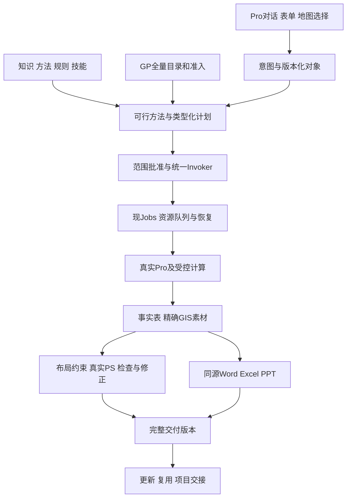

# ArcGIS Pro MCP全链路自动成果平台 · 最终稿V2

日期：2026-10-01。交付性质：**产品与开发规划候选（PASS CANDIDATE）；不是产品PASS、派工、安装或领先实测结论。**

本稿落实用户最终要求：功能广度与数量领先、专业质量、高智能、高自动化；先通用链路，再规划汇报/科研两类成果；普通用户无需PS设计；全部功能完善后制作统一一键包。继承已冻结范围，增加明确的智能决策、执行可靠性和支持矩阵。

## 1. 最终产品定位

**用户在ArcGIS Pro内指明对象、说明业务用途，系统理解资料、选择适用方法、组织分析、自动制图与PS设计、核验并交付同源办公成果；经验可以复用，数据变化可以生成新版。**

数量通过可信全量GP自动适配和真实能力扩展实现；智能通过有依据的决策和有界自主执行实现；质量由实际数据/产物检查和独立验证决定。

| 本稿文件 | 核心内容 |
|---|---|
| [本总纲](README_FINAL.md) | 产品范围、最终决策、创新和用户流程 |
| [功能与支持矩阵](CAPABILITY_AND_SUPPORT_MATRIX.md) | 能力/格式/行业/交付/环境、28原需求追踪与支持账本 |
| [智能与执行设计](INTELLIGENCE_AND_ORCHESTRATION.md) | 10智能工程项、方法选择、资源调度、恢复、设计及更新 |
| [核心合同与执行配方](CONTRACTS_AND_EXECUTION_RECIPES.md) | 计划/批准/预算/GP顺序、旗舰配方、对账、受控方案探索与经验改进 |
| [开发实施与发行](IMPLEMENTATION_AND_RELEASE_PLAN.md) | 现模块落点、13变更事项、WBS/依赖/工作量及最后一键包 |
| [验收与证据](VERIFICATION_AND_TRACEABILITY.md) | 数量、智能、功能、科学、PS、用户、竞争和实际包完成门 |

上一轮五件及20260927四件原文保持不变。新版校准其中过时的现役快照；业务schema、285底册和原Benchmarks仍由已生效裁定约束。原简报是需求来源，其中历史任务指令不构成当前派工，不沿用154、每批≤8或旧命名要求覆盖现契约。

## 2. 本轮现场起点

观察依据：G-239、DISPATCH §217、L4_INBOX当前D-108工单，且本轮静态复数Composition为224。

| 事项 | 当前已知事实及证据边界 |
|---|---|
| 源码/业务底册 | 224注册；285净名册（94 Read/33 Session/158 Write）；33错误码；GP白名单53，22扩容候选尚不等于正式准入 |
| 安装 | D-106已PASS/CLOSED；A2D6A0D0…/1,036,008B/43条目·224装机生效；G-239真机Pro3.5/net8，tools/list集合对齐 |
| 运行 | G-239有代表性只读调用；GP零执行、ps_*零调用。224工具发现不代表224业务全部验收 |
| 当前批次 | D-108/L4 ACTIVE：客户端配置→MCP initialize/tools/list/只读调用；具体范围是WorkBuddy/MCP接入，不是Adobe业务动作 |
| Adobe | 20个PS入口已注册；源码仍有single-writer-not-implemented及业务未尝试响应；真实通道、逐操作和设计能力仍需专门验证 |
| 已有基础 | 复用Invoker、Validator、WorkflowJobStore、素材包、规则/模板规格和基准，不重建第二后端 |
| 治理 | 四线/每线至多一ACTIVE、L1/L4写窗口互斥；本稿不抢当前工单或修改指挥台账；既有G-221/G-237授权按范围持续 |

本表是本轮读取时点快照；实际开工重新核对现场状态。无关软件、公开外发和任意写入不因规划新增自动获准。

## 3. 发行范围及数量目标

| 范围 | 固定目标和计数原则 |
|---|---|
| 稳定业务 | 完成285净底册的语义功能；处理未注册和已注册占位/缺业务证据，不只补61个名字 |
| GP规模 | 可信系统全集100%发现；完整参数合同编译目标≥95%；准入并真实运行验证操作≥max(2100, ceil(1.10×N))，对照目标集合覆盖100% |
| 通用与领域 | 20公共模块、8扩展领域、12产品包；10智能工程项为其内部工作分解，不增加工具数 |
| 完整任务 | 60原场景，36可执行模板（规划18/科研18），108标准成图；原73规则、60压力/60核心定义及77隐藏候选继续保留 |
| 行业 | BP01–BP10深度包，且显式覆盖生态资源、应急风险、公共服务、商业区位和科研任务入口；映射原场景，不换行业名增数 |
| 格式与成果 | 原格式矩阵完整继承，Excel/CAD/坐标文本/现代格式逐动作明确；GIS/PDF/SVG/EPS/PS图/PSD及可编辑Office/图册/长图/HTML逐合同验收 |
| 智能与体验 | 少重复追问、可靠空间指代、适用方法选择、可理解计划、有界修复、项目风格、技能迁移、更新及真实状态说明 |
| 发行 | 功能/数量/智能/体验门全部通过后制作最终统一包，再验实际首装/升级/恢复/卸载/首次成图 |

N为冻结对照版本、声明前提成立时去重的可执行GP操作数；1900+不是精确1900。GP操作包括分析、转换、建库和管理，另列独立语义能力。接口、别名、参数变体、技能和模板不互相加数。同完整Esri全集有相同数量上限；额外数量必须对应真实额外能力及其来源/许可/验证，无法扩大时该维度如实持平。

“支持最多”落实为明确目录、实际适配和可执行任务；不能用任意文件字符串、任意代码执行或未经验证组件表达全支持。所有格式动作、方法条件、版本与规模限额都能查到，当前机器可用性与开发成熟度分开。

## 4. 最终架构

沿用Shared无SDK、Compatibility/MCT访问SDK、Composition唯一注册、Configuration集中、MCP回环和现有受限Bridge。外部MCP客户端、Pro工作台、技能及自动修正共用同一Invoker/Jobs/策略。内部智能职责可分工，不因此启动多个独立写执行器。

## 5. 智能程度的十项具体工程

| 工程项 | 最终行为 |
|---|---|
| I01 意图与少提问 | 从当前资料/项目/规则读取已知条件；仅对会实质改变对象/方法/结论/写入范围的歧义提问 |
| I02 空间与数据理解 | @对象、空间关系、时间和单位有类型；原始表格/扫描资料形成带来源的Schema候选 |
| I03 工具与方法选择 | 先过滤数据/许可/科学条件，再检索和排序；给推荐理由、替代方法和缺口 |
| I04 计划可行性 | 依赖、参数、路径、预算和许可预检；有必要时做已批准的小成本试验，并标明试验结果 |
| I05 模型与任务分工 | 依据真实能力评测选择模型角色；压缩对话不压掉事实/批准；模型失败不重复GIS写入 |
| I06 有界修复 | 区分数据、参数、许可、宿主、文件故障；使用已验修复配方，方法变化另成计划 |
| I07 独立质量判断 | 解析真值/参考/守恒/拓扑/变形或往返检查；模型评价辅助，实际检查决定完成 |
| I08 设计与偏好 | 用途约束、真实文字测量、项目风格和参考稿布局候选；科学区域与视觉装饰隔离 |
| I09 技能适配 | 比较新数据与技能合同；允许已验字段/单位映射，未知变化清楚阻断 |
| I10 更新与影响分析 | 条款/规则/数据/方法/模板变化→受影响成果→审阅或授权范围内新版，不否定历史依据 |

智能是最终结果和正确决策率，不用模型自报置信度、多个“专家”互相赞同或思考文字长度证明。拒绝率、必要追问、错误执行、费用、耗时和任务成功率同时报告。

在X5/X6原方案比较/敏感性/集合语义内，增加有类型的ScenarioStudySpec：明确允许变化的变量/范围、目标、硬约束、候选和总预算，执行后交可行方案与权衡。成功任务/改稿/故障形成待验证配方候选，经跨数据回放和独立复核才启用新版本；创新不自动修改运行中的方法或权限。

## 6. 八项可形成优势的组合能力

1. **业务意图到适用方法：** 不认识GP工具也能得到合格方法和清楚理由。
2. **资料到可测试规则：** 文档/表格/规程形成可追溯的字段/规则候选，经验证后复用。
3. **操作到可移植技能：** 记录、泛化、换数据回放、依赖锁与版本回退相连。
4. **GIS到零手工PS成稿：** 科学保护、专业布局、真实预览和自动修正相连。
5. **一个事实到多种成果：** 图件、统计、Word、Excel、PPT和说明使用同一事实身份。
6. **数据/规则变化到一致新版：** 依赖分析、版本保护、重算重排与交付整体激活相连。
7. **结果到可解释出处：** 点击数值或结论可定位输入、方法、计算与引用。
8. **个人工作到团队接手：** 项目包保留事实/方法/设计/版本和必要资源引用，另一目录预检重放。

GeoAIChat已有对话、上下文、规范建库、录制/技能、知识和Office等公开能力；这些基础单项是学习方向，不称本项目独有。上述更深组合必须由真实任务证明。[官方功能](https://www.geoaichat.cn/features)、[更新记录](https://www.geoaichat.cn/api/packages/history)

## 7. 普通用户流程

首次使用：已验统一包→宿主/组件检查→模型或无模型模式→D盘项目目录→必要官方权限/连接向导→样例出图。必要配置和宿主权限与日常设计动作分开计时。

日常：

1. 选择资料，点选/框选范围或@图层。
2. 说用途，例如“比较设施覆盖，做汇报图和PPT，沿用本项目风格”。
3. 系统补足已有信息，显示对象/方法/输出/费用；必要关键问题集中呈现。
4. 批准任务范围后，系统分析、设计、检查和有限修正；推荐稿必须过科学门。
5. 用“更简洁、改横版、放大图例”等意图改稿，预览、撤销、比较；日常0次PS编辑。
6. 领取同源成果、加地图、保存项目风格或验证技能；新一期资料生成新版。

普通用户不需要维护字段映射脚本、PSD图层、技术配置文件或数千条方法规则。专业内容由已验资源包承担；新规范的重大歧义集中处理，不把整份规则审阅推给新手。

## 8. 自动化边界与用户控制

A0只分析提案；A1批准计划后执行；A2在批准的对象/方法集合/输出/预算内自主选择、修正和恢复；A3用户专门设置后，对限定数据范围按明确触发条件更新。A3是产品规划，不是本轮创建定时任务授权。

每次触发形成绑定当次输入版本的批准记录；持续策略不复用过期任务批准，不扩大删除、外发、费用或原件写权限。用户可取消、暂停、撤销可撤销步骤、查看真实状态与关闭持续策略。低风险样式默认值可见且可改，高影响歧义不能猜测。

## 9. 三条优先链和一键包

当前客户端接入批继续按现工单完成。产品增量重点为：可信全量GP适配与覆盖；真实Adobe逐操作/自动设计；Pro内智能任务工作台。资源调度、对账和输入一致性是三者共同前置，不到最后补。

统一交付继续插件形式：Pro esriAddInX＋已验Photoshop UXP ccx＋模板/规则/技能/帮助＋模型连接与诊断/恢复。商业宿主、许可证、模型权重和非必要软件不暗含随包附赠。

顺序固定为 **G-FUNCTIONAL（含GP、智能、全设计/行业/用户）→最终统一安装器/制包→实际包首装/升级/失败恢复/卸载/首图→G-RELEASE**。架构阶段定义兼容合同，安装器实现和制包仍后置。

“全面领先”以冻结版本、同资源、同任务、同人工介入的证据发表：数量/语义、科学质量、成功率先分别过门，再比较操作时间、总耗时和盲评。任何未达项保留清单并整改，不以更高数量抵消错误。
