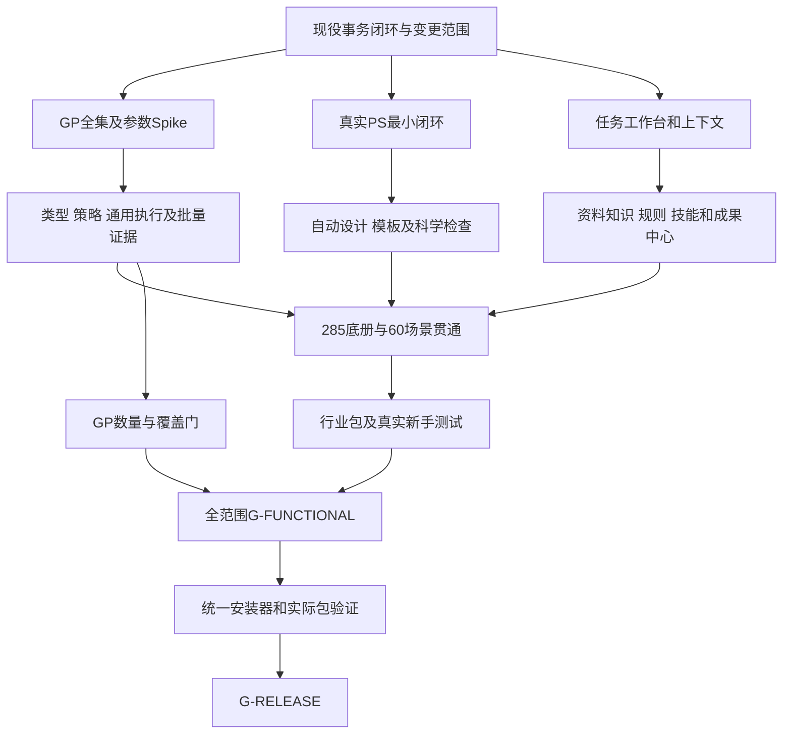

# 最终开发计划、行业落地与领先验收

日期：2026-10-01。状态：**规划交付候选；不是派工、安装指令或产品PASS。** 配套[最终方案](GIS_AUTOMATION_FINAL_PLAN_20261001.md)、[模块实现](GIS_AUTOMATION_PRODUCT_IMPLEMENTATION_20261001.md)、[GP规模工程](GP_AUTO_ADAPTER_AND_SCALE_20261001.md)、[竞品证据](GEOAICHAT_COMPARISON_20261001.md)。

## 1. 固定范围与启动条件

发行范围由六部分组成：285净业务底册、60完整场景、36模板/108标准图、20公共模块与8领域、12产品包、全量GP自动适配与数量门。BP01–BP10是场景的行业落地包，不把改行业名另算新工具或新场景。GP去重操作数和MCP入口数分别计数。

前四部分沿用既有冻结名册/schema/规则/样例/Benchmarks。产品和GP新增要求由本稿提出，公开契约、白名单、安全策略和依赖按SC01–SC08变更清单裁定。这里不修改既有受保护文件、不补写D工单、不跨越当前执行授权。

本轮观察截止G-238：D-106/L1在飞，D-107/L2已闭环；真实PS业务等待前置依赖。接续前重新只读核对当前工单/窗口，由指挥席安排；不是沿用历史全项目单ACTIVE。四线各自最多一ACTIVE，L1/L4共享Source/Tests/Config写窗口互斥，文档和基准按实际所属线管理。执行侧交PASS CANDIDATE，指挥侧独立验收。

G-221/G-237已有安装与P-05/发布授权继续按范围有效。功能范围扩大不等于任意依赖安装、模型下载或用户数据外发自动获准。所有项目临时/中转/证据在D盘拥有根，写前探针；不能通过覆盖系统TEMP或忽略宿主缓存来假装符合路径约束。旧仓库、原工程/fixture、回滚链及封存分发件保持只读。

## 2. 关键依赖与交付顺序

先形成可用纵向链，再扩大规模；全量GP目标进入最终功能门，不被悄悄延期成发行后的愿望。PS与GP是两条不同关键链，均不能用另一条的成绩抵消。

| 阶段 | 主要工作 | 必须交付的退出证据 |
|---|---|---|
| P0 接续与两周可行性验证 | 核对现役状态/SC范围；GA00–GA02与最小GA03/GA04试验；Adobe真实peer与两个最小模板；工作台表单任务 | 可信本机GP总数/类型/许可图谱，30–50项跨至少3工具箱与6参数族试验；实际运行仅限现准入或Spike明确裁定项、拥有fixture；PS真实导入/排版/保存重开；依赖和风险实测，不把试验冒充2100完成 |
| P1 公共内核补强 | 复用Invoker/Jobs，补任务上下文、批准、GP codec/effects/env、PS单写/对账、FactTable与检查 | 所有入口同策略；持久intent前置；未知副作用不盲重发；原件保护；真实宿主取消/断线/磁盘满 |
| P2 完整普通用户链 | U01–U08；首批规划/科研模板；真实Word/XLSX/PPTX；BP01/BP02 | 在Pro内完成分析→PS→办公成果→打开/加图；0次PS手工设计；同源数字与文件重开通过 |
| P3 广度与复用 | 接续未完成的285/8领域；U09–U12；GA05–GA07与批量证据；BP03–BP10 | 换数据技能回放、规则已知答案、逐格式互通；GP逐项正例/负例/结果证据持续累积 |
| P4 全范围验收 | 60场景、108标准图、60压力行、产品/行业/GP门、隐藏样例和新手任务、竞品共同任务 | 不降规格、不删失败；独立评审；缺口清零或经正式变更明确处置；未经裁定不能缩范围报全功能完成 |
| P5 最终统一包 | 功能与体验门通过后开发安装器、制包、实际包首装/升级/恢复/卸载/首图 | 实际包身份/hash/组件发现与功能版本一致，完整安装矩阵，G-RELEASE |

现役维护安装与已有分发件遵循原工单，不被P5取代；本版新增全功能统一包在P4之后制作。功能阶段使用开发部署环境验证软件，不以尚未制作的最终安装器作为P4前置，避免循环依赖。

迭代按两周提交可审查增量：前两周取得P0证据；第3–4周目标为最小统一执行/对账、GP有类型参数和PS两类纵向样例；第5–8周目标为工作台预览版、GP首批批量证据和同源Office示范。后续每两周滚动交付模板/领域/行业与已验证数量清单。早期预览不是U01–U12或2100全范围完成；宿主/契约前置未过就停止依赖步骤并明确调整计划。

## 3. 产品包WBS、工作量与验收

以下人周是**新增产品工程的初始估算**，含开发和包内验证；不包含尚未完成的领域算法、真实Adobe业务、2100逐操作证据、行业专业内容和最终安装工程。依赖由实测确定，不宣称固定日期一定交付。

| 包 | 主要开发项 | 前置 | 初估人周 | 包退出门 |
|---|---|---|---:|---|
| U01 | DockPane/MVVM、任务应用服务、对话/步骤/预览/成果身份 | 现Invoker/Jobs、SC01 | 4–6 | 表单与聊天共用执行；重开/重复点击；无需抄JSON |
| U02 | Provider适配、凭据引用、流式提案、预算/摘要/发送策略 | U01、SC01 | 2–3 | 本地endpoint和一个远端实际接通；401/429/坏schema/超时 |
| U03 | 持久session、ContextSnapshot/Delta、SDK事件适配 | SC01、MCT | 2–3 | 多地图/项目/会话隔离和陈旧引用；错误对象写入0 |
| U04 | @标签、点选框选、完整选择物化与版本 | U03 | 2–3 | >10000选择不截断冒充全集；明确指代目标识别≥95% |
| U05 | AnalysisPlan投影、Patch/预检、暂停取消续作 | U01/U03、P1 | 3–4 | 可视/MCP执行同合同；陈旧Patch拒绝；取消实际响应 |
| U06 | 数据候选聚合、质量/来源预览、ImportPlan | U03、格式adapter | 2–4 | 50冻结检索例Top5召回≥90%；多结果不默认取第一 |
| U07 | 文档抽取/索引、MethodCard/Citation、来源/未知状态 | U02、合法样本 | 3–5 | 引用支持结论；版本冲突、扫描失败、提示注入 |
| U08 | 成果账/通知、Report/Workbook/PresentationSpec与真实文件 | FactTable/PS、SC05 | 5–7 | 绑定数字一致100%；文件重开/可编辑性；缺必需项不全绿 |
| U09 | 语义事件、录制gap、参数泛化、草稿与回放 | U05、P1 | 3–5 | ≥2新数据集；旧路径/批准不泄漏；未知手工动作不假录制 |
| U10 | 技能manifest、依赖锁、版本/回退/测试/作者入口 | U09/U07、SC07 | 3–5 | 跨项目重绑、坏包/缺依赖、不可变版本；不执行任意代码 |
| U11 | NormSource/RuleCandidate/Decision/Pack，受限规则与专业确认 | U07、专业标注、SC07 | 4–6 | ≥30规则及≥10陷阱，高影响误编译0；未知覆盖显式 |
| U12 | 行业manifest/资源编排、格式服务接入、包级验收 | U08/U10/U11、SC06 | 1–3 | 完整输入/方法/规则/模板/正负例/更新；行业资源另计 |
| **合计** | **新增12产品包** |  | **34–54** | **没有把已完成代码全部重新计工** |

两名产品开发加共享QA/专业支持时，产品包自身关键链初估16–26周；这不是整个版本工期。QA、方法和Adobe测试不因AI写码快而消失。单人顺序执行接近34–54开发人周并需另配支持；增加成员受Source窗口和真实宿主资源限制，不按人数线性缩短。

## 4. GP工程WBS与2100规模资源

规范化GP操作包括分析算法、转换、建库和数据管理；不是每项都为数学算法。别名、旧新名称、compact/granular、与专用工具重叠均按同一操作身份去重，独立语义能力另表复核。

设N为冻结竞品版本、声明前提成立时去重的可执行GP操作数。本项目准入并运行验证目标为**≥max(2100, ceil(1.10×N))**，同时覆盖对照目标集合100%。N未取得时保留未知，不把1900+当精确1900。

| 包 | 工作项 | 工作量处理 |
|---|---|---|
| GA00 | 可信全集、对照N、当前53/22映射、去重与环境冻结 | 两周Spike内先形成真实基线；对照取不到目录则明确N未知 |
| GA01 | 只读采集器、快照、来源/版本/hash和差异 | 系统工具与未知自定义pyt分离；不Import任意路径 |
| GA02 | 有类型schema/表单/codec、动态条件、unsupported记录 | 先通用类型，再值表/复合/FieldMap等；全工具分母固定 |
| GA03 | effects、输入原位写/DDL、参数条件、环境/许可/路径/恢复 | 家族规则生成候选，逐名准入；不能由参数direction推读写 |
| GA04 | envelope→Invoker→受控Host→结果检查→receipt | 旧run、compact、granular策略一致；持久intent失败零执行 |
| GA05 | 渐进检索、方法与条件卡、可选生成MCP入口 | metadata与准入接口分清；Composition唯一注册、分类manifest |
| GA06 | fixture生成、逐操作输入/断言、关键负例/许可、批量证据账 | 每个计数项有真实合法正例；家族测试不替代逐项运行 |
| GA07 | 升级diff、合同兼容、扩展来源与复核 | 新工具/版本不自动准入；扩展需真实独立能力与来源/许可 |

两名GP工程开发的目录/编译/策略/执行基座初估10–16周，**不包括全部2100项验证与新增独立算法**。它和产品包可以部分并行，仍服从现役写窗口。两周Spike必须测出单位证据成本和瓶颈，随后冻结资源及版本日期。

批量验证预算按下式分解：

`总人时 = 参数族/数据族fixture建设 + Σ逐操作(输入配置 + 执行 + 断言 + 失败定位/修正 + 独立复核) + 许可/机器/升级覆盖`。

并行流水线可复用fixture和断言，并给每项独立结果；不能用共享案例复制2100张PASS。超时、缺许可、mock、schema读取或正确拒绝只提供对应负例/前提证据，不能计入已运行正例数。缺少实际参考环境的项标未验证。

若本机Esri全集不足数量门，GA00就公开缺口；GA07审查对照未覆盖的系统操作及真实独立扩展来源，单列合同/许可/fixture/方法验收与工作量。不能为了2100使用别名、组合流程或未核准软件补数。同完整宿主全集相同则该维度如实持平；领先结论限定已证范围，而不是数学上不存在的更大全集。

## 5. PS、领域与行业内容的额外容量

| 工作池 | 具体工作与估算边界 |
|---|---|
| Adobe闭环 | 配对/权限/能力、单写modal/固定动作、文档拥有、素材/文字/图例/PSD保存重开与恢复，初估4–8工程人周；实际版本Spike后校准 |
| 自动设计与36模板 | 真实字体测量、约束/RepairRule、科学保护、模板编译、印刷/屏幕与大图；与现模板资产逐项核对后估工，不拿36规格当36可执行模板 |
| 8领域与285余额 | 从当前224和真实已验状态逐项形成差距；61未注册不等于只有61待开发，已注册占位/缺业务证据也进待办；按算法/数据/许可而非每工具同工时估算 |
| BP01–BP10 | 规则/样本/模板/交换配置与专业审阅初估10–18内容人周；复用原场景和模板；新CAD/TXT/在线/HTML适配开发另计，不能装进1–3周U12编排预算 |
| 全范围独立QA | 108标准图/60场景/60压力、GP逐项、隐藏和新手、竞品/多宿主；依据实际批量执行与人工复阅吞吐估算 |
| 最终安装发布 | 功能冻结后初估2–4工程人周＋实际包矩阵执行；安装权限/官方机制、首图、升级/恢复/卸载与文档实测 |

总历时是各依赖链和有限机器/写窗口的最长路径，不能把34–54、10–16等相加后冒称准确交付周数，也不能把原52–80周路线直接重启。最终方案固定范围和验收，交付日期在真实Spike及剩余清单后定；在此之前不承诺“若干周就完成2100+”。

## 6. BP01–BP10行业包映射

| 包 | 行业内容与原场景 | 具体实现与完成条件 |
|---|---|---|
| BP01 村庄/用地专题 | S10/S20/S21/S23/S26/S60 | 冻结分类/指标与输入规则；约束叠加、方案AB、图则/汇报模板；同源统计/PPT，换期无旧数 |
| BP02 规范建库与审查 | S01–S06/S20 | U11抽取字段/类型/域/关系候选；已验RulePack→SchemaPlan→副本建库/QC；差异和未覆盖条款可追溯 |
| BP03 地块与界址图则 | S03/S10/S19/S23/S26 | 合法地块/界址顺序、编号/字段/坐标与图册；黄金编号/闭合检查；批量0次PS编辑；不自称满足未知地方规程 |
| BP04 多尺度区位 | S13/S19/S23/S36 | 地理范围/比例/图框层级、合法底图/DEM；多尺度区位与科研面板；不同CRS/高程/NoData和比例尺核验 |
| BP05 调查分类与质量 | S04/S15/S20/S45/S46 | 冻结调查/用途分类版本与交叉映射；类别/面积/单位守恒；参考标签独立，未知/未映射不偷偷归类 |
| BP06 约束占用核查 | S10/S20/S21 | 来源/有效时间/地区与边界策略、叠加/统计/定位；单位/容差/例外验证；没有依据不输出法定合规结论 |
| BP07 CAD与坐标文本 | S06/S30/S59及互通子例 | 专门CAD符号映射、CoordinateTextProfile、实际转换adapter；往返几何/CRS/编码/精度/丢失清单；SC06正式审查 |
| BP08 底图与历史对比 | S16/S19/S24/S29 | 批准的提供者、缓存/来源/许可/时相和范围；并列比较与更新；分辨率/季节/来源差异不当真实变化 |
| BP09 交互空间展示 | S35/S36/S59/S60子例 | HTML/图层导出adapter、2D/3D资源与浏览器支持矩阵；离线缺资源、访问/分发边界；截图不能冒充交互 |
| BP10 统一专业交付 | S25–S30/S60 | GIS/矢量图/PS图/PSD＋Word/XLSX/PPTX同FactTable；真文件重开/编辑性、总目录与更新、原件保护 |

每包至少一正例、一负例、一换期/换规则例、一完整交付；BP01/BP02先形成完整样板，其余随依赖接续。实际使用的规范、分类和素材需具备来源与适用性；本稿不设未经核对的政策数值。

## 7. 全范围验收门

| 门 | 不可替代的证据 |
|---|---|
| G-CORE | 285逐项语义/注册/合同/业务/许可状态对账；Native/GP/Python/PS分类与现实一致；未完成不能由同名工具替代 |
| G-GP-DISCOVERY | 可信全集采集100%并去重；metadata状态不混入可执行数量 |
| G-GP-ADAPTER | 分母为冻结可信全集去重操作数，分子为全部参数与必要动态条件正确编译的操作数，目标≥95%；另报参数实例/无需手写类/unsupported，不排除难项缩分母 |
| G-GP-EXECUTION | ≥max(2100, ceil(1.10×N))真实准入并运行验证操作，覆盖对照集合100%；逐项输入/宿主/许可/策略/断言/关键负例，独立复核 |
| G-PS | 指定Adobe真实peer、权限/单写/对账、导入/排版/保存关闭重开/导出、两类最小模板各3输入，0次PS手工设计 |
| G-SCENARIO | 60既有场景按冻结正例/负例/方法/交付条件通过；合成样例和真实任务证据分别列 |
| G-DESIGN | 36可执行模板、108/108标准图自动完成；0次PS手工设计；首轮质量合格≥90%即≥98/108；有限自动修正后的严重科学错误0 |
| G-PRESSURE | 沿用60冻结压力行及其预置合格/拒绝/限制判据，达到预定≥95%符合率；不将应拒绝项变成成功或删除困难行 |
| G-PRODUCT | U01–U12包级门；模型/上下文/选择/工作流/知识/Office/规则/技能真实业务；数值一致100%、错误目标写入0 |
| G-DOMAIN | BP01–BP10正/负/更新/交付通过，规范和格式适用边界明确 |
| G-HIDDEN | 12项事先封存的隐藏任务，完成≥11/12；所有计入成功的科学硬门通过，人工介入如实记录 |
| G-USABILITY | 8–12名试用→修正→24名无PS经验用户，每人≥2代表任务，至少48任务；独立完成率≥90%、0次设计师代操作；技术人员提示/代操作单列 |
| G-FUNCTIONAL | 上述范围分别过门，真实文件/恢复/配置前提齐全，未验证/失败清单不被注册数或演示掩盖 |
| G-RELEASE | G-FUNCTIONAL后制包，用实际包首装/升级/失败恢复/卸载/首图验证，身份与内容一致，独立裁定 |

设计验收沿用现73规则、108标准图目标、60核心控制定义行（每项至少3轮）和现60压力行。现77隐藏候选是定义/引用，另独立选择并封存至少12适用未见任务；已见例修复只算回归，再验泛化要换未见集。108标准图的各模板3个合格正输入与黄金输出仍须逐项冻结，不能把模板规格当真实成图证据。162场景侧档案不是162标准图；已跑S18黄金样例也不是全108通过。新产品测试独立增补，不能重写原锚点把失败洗掉。

GP运行成功不只看exit/status：必要输出存在/可读/内容或状态断言、原位改动范围、Derived/侧车/中间件、环境恢复和回执齐全。产物存在性Unknown进入对账，不按不存在处理。写前intent持久化失败零执行；写后receipt失败不报完整成功或重试。

## 8. 对GeoAIChat的10共同任务与4扩展任务

共同集合先依据冻结版本的公开声明和实测前提确定；当前对方仅DECLARED，尚未运行对照。

| 共同任务 | 相同输入与交付合同 |
|---|---|
| C01 文档字段规范建库 | 同规范/表格→数据库Schema与创建结果，单位/域/字段和来源 |
| C02 几何质量治理 | 同数据→定位问题、修复拥有副本、前后对照，不改原件 |
| C03 分类与统计 | 同已冻结分类代码、未知类→结果与面积/单位检查 |
| C04 约束叠加占用 | 同边界/来源/容差→空间结果、统计与限制 |
| C05 专题地图 | 同用途/数据/整饰/输出规格→可读地图和分类准确性 |
| C06 地块图则批量 | 同地块/字段/编号规则→完整图册与无丢页 |
| C07 多尺度区位/地形 | 同范围/底图/DEM和许可→区位/地形图，比例/高程正确 |
| C08 Office多成果 | 同事实和可编辑性合同→Excel/Word/PPTX，数字与地图一致 |
| C09 成熟操作复用 | 同首任务和另一数据集→参数化技能/复用，前提与结果校验 |
| C10 项目知识问答 | 同资料/版本问题→可定位且支持结论的引用，未知不编造 |

| 扩展任务 | 本项目必须证明的新增深度 |
|---|---|
| E01 规程编译 | 条款→受限规则→已知答案、否定/单位/例外/版本审计 |
| E02 可移植验证技能 | 语义录制→无旧路径/批准→跨工程/数据回放、依赖/失败恢复 |
| E03 零PS专业设计 | 两类PS图及科研保护、中文/混排、有限修正、PSD保存重开 |
| E04 统一更新与恢复 | 数据/规则/方法变化→图/Office同步，宿主中断对账，原件/设计意图保留 |

对方公开证据未覆盖的扩展任务不自动记竞品失败、0成功或速度无穷大。只有实际共同支持和前提成立才能比较；扩展先报告本项目能力，未来能共同测试时再纳入。

共同任务初始规模：10任务×3输入条件×3轮＝**每产品90次尝试**。三輪重复不是三个独立用户；原108成图、新手48任务、GP逐操作与90竞争尝试分账，不能相加冒称独立样本数。

另设C-GP目录/编译/执行广度对照，按参数族、工具箱、读/写/DDL、许可、动态约束分层。其试跑只回答分层质量，不能代替2100项数量证据。比较不能用285命名入口对1900+GP数。

## 9. 公平条件与领先判据

冻结产品版本、硬件、Pro/PS及扩展许可、同输入/任务合同/时间限制、模型预算和人工介入规则。共同模型对照与各产品最佳允许配置分别报告；初始知识/模板/专家准备给双方相同预算，或把成本计入各自总成本。

所有尝试固定分母；对方已声明支持且前提成立的超时、错误、崩溃计失败，不能事后改“不适用”。排除项在运行前定并另表披露。保存配置失败、数据准备和人工修复记录；收费服务与模型/许可成本分开。

| 维度 | 领先目标与统计 |
|---|---|
| 数量/覆盖 | G-GP目标和对照集合覆盖独立过门；业务语义、格式、场景另表；接口重复不补数量缺口 |
| 科学质量 | 严重数值/单位/分类/空间/方法/引用错误为0；首先查事实，审美不可抵消 |
| 完整任务成功 | 本项目不低于最优对照；自动成功/人工辅助成功/失败分别列；90次结果与不确定性全披露 |
| 主动操作 | 完成配对样本的中位用户操作时间降低≥50%；失败样本同时保留，专家准备另列 |
| 总耗时 | 完成配对样本墙钟时间降低≥30%；冷/热启动分开，不能去掉自身恢复时间 |
| 视觉质量 | 盲评胜率≥70%，定义为胜出数/全部有效配对评价，平局进入分母；评阅者和合同一致 |
| 成本与恢复 | 费用、配置/模板准备、恢复/介入、资源峰值报告，不用单一token成本冒充整体成本 |

数量、科学质量和成功率三门**分别先通过**；操作/总时间/盲评三项至少两项达到预先固定的实质改善，才声称在共同范围形成明显优势。置信区间按任务/输入/用户/评阅者的聚类结构报告，不把三次重复当独立样本扩大信心。区间不足支持优势时仅报探索结果，增加样本或缩小结论范围。有限样本不能支撑无限行业的“全球全面领先”。

## 10. 普通用户与自动化占比怎么验

正常流程只有：选择资料/范围→用途与任务合同→一次集中确认必要歧义/方法/输出→系统执行/检查→简短修改或领取→以后换数据更新。首次模型Key/宿主权限/工作目录配置独立计时，不能藏在零操作宣传里。

12条代表工作流覆盖建库、治理、叠加、栅格、规划、科研、图册、Office、更新、恢复、技能、规则；都记录用户动作、主动分钟、PS手工编辑、专家代操作、未解释阻断。目标：标准已验任务0次PS手工设计、无需写代码或配置文件、必要确认集中呈现；复杂新规范由专业包维护者集中审阅，不能把数百条规则扔给普通用户。

数据/许可不足时显示可用方法、理由、缺口和真实替代方案；用户不浏览2100项列表。选择适用方法的正确性、检索命中、解释清楚和实际完成率一起验，不只展示目录数字。未通过科学门的视觉预览不能作为推荐成稿。

## 11. 一键安装的最终实现与验证

继续插件形式：Pro `.esriAddInX`、真实已验Photoshop UXP `.ccx`、版本化模板/规则/技能资源、引导与诊断/恢复；模型为已有本地或用户选择的连接，商业宿主/许可证不随包提供。Photoshop官方部署与权限流程需真实版本验证，不能用不支持的静默复制替代安装。

功能门全部通过后，统一安装器完成检测→兼容/许可提示→组件计划→D盘资源与正式插件部署→配对/连接→版本核对→样例首次成图→回执。需要官方确认的步骤用向导，不让用户手工配置技术字段。

实际包矩阵至少覆盖：正式支持的宿主版本、具备/缺少PS、无模型与已配模型、首次/已有版本、安装中断、磁盘/权限失败、资源损坏、升级失败回滚、卸载保留用户成果。缺PS环境可安装GIS组件，但标明非全功能验收；不得用降级GIS通过替代全链包通过。

卸载仅限项目拥有组件，保留工程/成果/用户修改/封存与回滚证据。实际客户端配置Plan/Validate与已获授权Apply/Restore按范围执行，不顺手写其他真实客户端配置；Key不入包/教程/日志。

## 12. 下一轮可审查交付

指挥侧可据本稿拆分：SC范围/现役依赖校准→GP两周Spike→PS最小真实链→Pro工作台与上下文→同源成果→规模/行业/复用。每轮交代码/资源变更摘要、合同/版本差异、测试输入/期望/真实输出、hash/路径、负例/恢复、PASS CANDIDATE与未验证清单，再独立验收。

这份计划固定了目标、实施路线、依赖和验收口径；它不宣称224注册已经完成285业务，也不宣称2100GP或PS自动设计已经交付。最终领先依靠逐项实现和同条件证据；未达数量或质量门持续整改，统一一键包保持最后制作。
