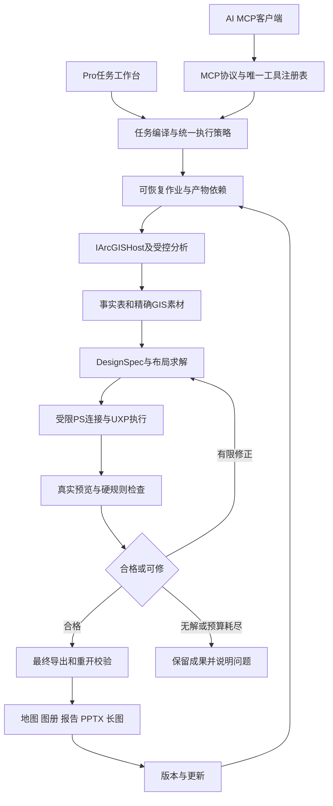

# 最终模块实现与开发计划

规划编号日期：2026-09-27；完成整理：2026-09-28。配套[总纲](GIS_AUTOMATION_FINAL_BLUEPRINT_20260927.md)、[能力目录](GIS_AUTOMATION_FINAL_CAPABILITY_CATALOG_20260927.md)。状态：设计交付，待正式F03冻结与分批实施。

## 1. 架构总图与必须保留的边界

架构分层不变：所有ArcGIS SDK对象经Compatibility宿主服务与MCT；Shared没有SDK引用。工具只在 `Composition.BuildRegistry()` 注册；内部服务不形成第二注册中心。配置统一由Configuration解析。MCP仍默认 `127.0.0.1:6520/mcp`；不开放公网、任意脚本或6511旁路。

拟议类/服务名用于说明职责，不表示仓库已有实现。具体文件归属由F03设计评审决定，避免凭计划臆造既有项目。`ArcGISProMCP.Current`目前是占位，不等于已支持第二套宿主API。

## 2. 核心契约：各模块传什么

| 契约 | 最少字段与用途 |
|---|---|
| TaskBrief | schemaVersion、taskId、用途/受众、输入引用、输出根、方法约束、尺寸/媒介、风格、预算、必需交付项 |
| DatasetContract | 数据身份/内容指纹、字段/类型/单位、CRS/垂直基准、时间范围/历法、NoData、质量、许可和敏感性标签 |
| CapabilityRecord | 实际工具名/schema版本、读写effects、宿主/许可、支持规模、正负例与验证证据；源于唯一Registry |
| AnalysisPlan | 有类型的DAG、输入输出依赖、步骤参数、资源预算、允许effects、失败/取消/补偿政策；不包含任意代码 |
| ApprovalRecord | 服务端生成的范围摘要、plan digest、输入/输出范围、允许操作/修正、有效期、用户决策来源；客户端confirm=true不自动生成批准 |
| FactTable | factId、值/单位/分母、统计口径、CRS/时段、来源artifact、方法/参数、质量或区间、有效revision |
| DesignSpec | 不可变revision、模板/规则/渲染器版本、字体/ICC、页面物理尺寸/像素、图框范围/旋转、语义ID、factRef、保护项、布局约束 |
| RenderPlan | 受限宿主动作、输入hash、期望输出、文档拥有关系、步骤幂等键、共同画布、渲染预算 |
| DesignPatch | baseRevision、受限修改意图、目标语义ID、批准范围；旧revision不覆盖新版 |
| CheckReport | 每项pass/fail/unknown、严重度、数值容差、证据引用、允许修正规则、对应revision |
| ArtifactManifest | 路径/hash/大小、类型、来源/依赖、方法/设计revision、许可、创建步骤；没有证据不补造历史 |
| DeliveryManifest | 必需/可选文件、逐件校验、总体完整性、缺项/限制、输入到最终物的追溯关系 |

这些契约先用JSON Schema与C#不可变模型冻结，添加迁移/兼容测试。工具响应继续复用33错误码，如 `INVALID_ARGUMENT`、`LICENSE_REQUIRED`、`INVALID_STATE`、`CANCELLED` 等；新的细原因进入经评审的details。内部状态名不自动成为公开错误码或破坏原响应结构。

## 3. 20个公共模块怎么实现

| 模块 | 实现方式与边界 | 依赖、交付及关键验收 |
|---|---|---|
| M01 能力目录 | 从唯一Registry与实际schema生成目录；叠加版本/许可/规模/证据；关键词和场景检索后返回小集合及详细schema | 最早建立；与154及后续每项双向对账；IMCPTool默认requiresArcGIS与McpToolBase来源差异有断言；发现不改变MCP协议兼容 |
| M02 数据理解 | 复用Host只读元数据、字段统计、有限抽样；规则识别单位/时间/角色并给置信度；深读与轻扫分层 | M01；不猜CRS和业务分母，歧义集中呈现；百万要素不默认全量送模型 |
| M03 质量治理 | 质量规则目录输出结构化issue；只读诊断与修复副本分开；域/子类型/关系类操作经schema预检、锁检查和可恢复计划 | M02/M05；重复/空值/拓扑/异常单位有正负例；APRX快照不能当GDB备份 |
| M04 任务编译 | 表单优先生成TaskBrief；自然语言输出同一结构；场景配方匹配后做类型、依赖、许可、路径和成本检查 | M01/M02/M05；缺模型时标准任务仍可用；模型不能凭空创造工具/字段/事实 |
| M05 统一执行策略 | 提取IToolInvoker，统一参数校验、全局只读、批准、许可、路径、取消、审计和结果规范；MCP、工作台、配方、修正都调用它 | 最早实现；现Router和FolderWorkflow直接ExecuteAsync路径全部迁入，禁止只保护新入口；避免Invoker与Router递归 |
| M06 作业与恢复 | JobStore兼容旧JSON和现JSONL；intent/receipt日志、租约与fencing generation、对账和取消；job控制与长渲染队列分离 | M05；D-079增量成果保留；强制D盘配置根与写探针；旧owner禁止迟到写；磁盘满/尾损/回执丢失有证据 |
| M07 空间与网络分析 | 现Native/受控GP为执行底座；新增算法逐名审查；网络、权重和方法参数显式；输出图层同时产生FactTable | M01/M02/M05/M06；已知答案、CRS/单位与无许可负例；直线不替代路网 |
| M08 栅格与遥感 | 共同格网/分辨率/NoData/波段预检，分块处理与预算；受控算法和已登记模型；结果保留产品/参数与有效区 | M02/M05/M06；像元抽检、误差、块边界；禁止将任意表达式当安全脚本通道 |
| M09 符号与标注 | 把分类、色阶、标签表达式/字体绑定事实和数据schema；通过Host/MCT改地图；量化类与图例共用定义 | M07/M08；标签碰撞/截断、分类边界、缺值、时间多图一致；渲染后复核 |
| M10 模板与布局 | 版本化语义槽位＋约束求解；候选布局筛选；WPF测量早筛、目标PS实际测量定稿；支持尺寸/横竖/附页重排 | M09与字体试验；无解真实返回，禁止无限缩字号；布局创建尺寸与导出DPI分别设置，不虚构CreateLayout的DPI参数 |
| M11 GIS素材包 | 固定共同画布、原点、图框范围/旋转、导出DPI；透明语义分层＋manifest；GIS原生矢量文件另存 | M09/M10；逐层hash、配准锚点、导出恢复；不能导出时修改用户原项目来绕过 |
| M12 PS连接 | UXP主动连本机受限队列；短期配对/能力握手/心跳/断线；明确宿主与文档身份；专用路径和认证不混作MCP工具入口 | P-05＋F04-A/M05/M06；当前transport只有MCP POST，必须真实实现内部路由；不能宣称已存在 |
| M13 UXP执行 | TypeScript插件＋固定动作处理器；DOM优先、限定batchPlay补缺；executeAsModal单写队列；保存/重开、字体和文件token检查 | M12；仅拥有或明确选定文档，不能抢用户activeDocument；任意JS/actionJSON不暴露给模型 |
| M14 自动设计与修正 | DesignSpec→纯布局求解→RenderPlan；科学硬约束先筛、美观评分后排；issue映射白名单repair；样式建议转有限Patch | M04/M10/M11/M13；最多2轮初始修正，单作业共享预算、退步停止；不以生成图替代科学地图 |
| M15 版本与更新 | 内容/结构强指纹＋依赖DAG＋不可变revision；失效重算；默认全重渲染；风格Patch继承，事实文字factRef更新 | M02/M06/M14；外部修改保留原件/生成新版；局部更新只作通过等价检查的优化 |
| M16 检查与交付 | 地理/数值/结构检查＋实际渲染检查＋文件重开；印刷/可访问性检查；逐项manifest；报告/PPTX读取同一FactTable | 检查接口F03先定义、贯穿开发；有必需项失败则整体不完整；不能仅文件存在就PASS |
| M17 用户工作台 | Pro WPF/MVVM：任务卡、集中歧义、状态、真实预览、快捷修改、成果列表、恢复；SDK对象不跨线程持有 | M04/M06/M16；共享Invoker；0次PS设计，输入和输出路径明确；低频专家设置折叠 |
| M18 互通与提供者 | 固定格式/提供者适配；本地现代格式优先；网络严格endpoint/分页/范围/预算/凭据隔离；外发单独批准 | M05；G-190三项暂缓未解除前不执行在线发现/导入/发布；自动发现不能悄悄上传数据 |
| M19 评测与观测 | 工具/作业/宿主trace、耗时/成本/失败/介入指标；已知答案、隐藏集、黄金图、故障注入与版本矩阵 | 自F03持续；日志脱敏；声明/静态/运行/E2E/独立验收分层；不由执行者自批PASS |
| M20 安装与恢复 | 最后扩展现有安装框架；esriAddInX＋CCX＋资源，宿主检测/组件版本/恢复；真实客户端配置采用Plan/Validate/Apply/Restore | G-FUNCTIONAL后才实现新统一安装包；实际包验证安装/升级/失败恢复/卸载；陈旧备份拒绝覆盖用户新配置 |

## 4. 八扩展域的内部设计

| 域 | 可复用服务与算法路线 | 先做的验证 |
|---|---|---|
| X1 时空6项 | TemporalIndex/TimePolicy；时空立方与有限统计算法；固定时间切片驱动现制图引擎 | 缺测/不规则时段/季节/时区、合成变化点、时间留出回测；空间图与序列值同源 |
| X2 三维8项 | SceneHost适配隔离SDK；真实地面/高程/Z单位；受控可视域/通视/剖面/挖填方；渲染素材进入设计层 | 平/斜坡/遮挡已知答案、Z基准变换；2D好看不能证明3D数值正确 |
| X3 点云6项 | PointCloudDescriptor＋批量/分块处理；格式适配与质量读；在拥有副本上分类/地面产品 | 点数守恒、参考高程、tile边界、密度/配准差；大点云限额与取消 |
| X4 遥感8项 | SensorProfile/QA定义、共同格网、训练样本协议、ModelRegistry；固定推理pipeline | 波段/归一化错误、权重hash、训练/验证分离、真实模型与无GPU路径；占位模型不算能力 |
| X5 科研8项 | MethodRegistry＋数值实现或受控算法；统一种子、空间分块、误差/情景类型；求解budget | 解析/合成真值、数值容差、空间泄漏、无依据误差模型拒绝；不确定性与敏感性分开 |
| X6 路网6项 | NetworkProfile统一阻抗、方向、限制/容量/时窗；复用Host/许可适配；成本面单独方法类型 | 断路/单行/未定位/容量不足、已知小图最优解或可验可行解；求解终止与未分配清晰 |
| X7 互通4项 | 格式adapter/ConformanceRule、垂直转换格网目录、离线依赖打包、科学维度序列化 | 数据往返、精度/空值/Z/M/时间、缺格网、外部资源断开后的离线重开 |
| X8 文档2项 | DocumentSpec共用FactTable；PPTX采用经评审的Open XML生成库/适配器，报告生成HTML再按已验通道PDF/DOCX；不依赖PS写PPT | 可编辑文字/图表边界、字体、页面溢出、真实Office/目标阅读器渲染与重开；截图不能证明可编辑 |

具体第三方依赖、许可和版本在Spike阶段核验，未批准前不安装。已有Python Bridge如需承载限定数值方法，只可增加经过审查的有类型操作与参数，不能暴露任意Python执行。

Esri公开文档提供地面点分类和新兴热点等算法路径，但需要单独核对本机许可、当前Pro版本与白名单，不能直接把文档存在当已接通：[Classify LAS Ground](https://doc.esri.com/en/arcgis-pro/latest/tool-reference/3d-analyst/classify-las-ground.html)、[Emerging Hot Spot Analysis](https://doc.esri.com/en/arcgis-pro/latest/tool-reference/space-time-pattern-mining/emerginghotspots.html)。

## 5. PS通信、生命周期和文件访问的落实

设计选择：UXP插件主动向Pro内本机队列拉取已批准命令、回送状态。拟议内部路由 `/internal/ps/v1/*` 由同一配置与认证模块维护，不形成新公网监听；准确路由/方法在F03 ADR冻结。UXP manifest声明必要的本机网络与文件权限，配对secret不进入模型上下文或日志。

消息至少含requestId、jobId、documentId、specRevision、stepId、op、typedArgs、artifactRefs、deadline、approvalDigest、fencingGeneration。仅接受有限op，Host/Origin策略、令牌有效期、重放、大小、路径拥有关系分别验证；URL/path不是任意执行能力。长操作用作业状态回报，不占用单次HTTP直到渲染结束。

面板有create/show/hide/destroy生命周期；命令组件执行后结束，不能假设它是永久后台服务。F04必须测PS已开/未开、插件显示/隐藏/关闭、重启、用户操作、端口忙和配对撤销。[Adobe生命周期说明](https://developer.adobe.com/uxp/guides/explanation/concepts/panels-and-commands/)

修改PS状态使用executeAsModal；同一时刻的模态访问受限，因此单写队列与取消/状态控制分离；不要用高并发修改同一文档。[Adobe模态执行说明](https://developer.adobe.com/photoshop/uxp/2022/ps-reference/media/executeasmodal)

文件权限不能只记一个永远有效的字符串。会话token与持久token分开处理；文件移动/权限变化导致失效时重新定位或引导授权，不自动扩大访问范围。[Adobe文件访问说明](https://developer.adobe.com/photoshop/uxp/2021/uxp/reference-js/Modules/uxp/Persistent%20File%20Storage/FileSystemProvider/)

## 6. 自动设计与修正算法

1. 把Brief、数据画像、事实表、模板和显式项目风格规范化为DesignSpec。
2. 用约束求解产生最多12个结构候选；先淘汰图框、必需图例、最小字号、量化颜色等硬错误。
3. 结合内容密度和用途选最多3个进行真实PS低清预览；保存各自revision与检查报告。
4. 机器检查溢出/碰撞/裁剪/事实/保护项，再做冻结美学量表评分；模型意见可辅助，不作唯一判据。
5. 有限修正规则可调整容器、换行/图例列数、留白、允许字体方案、附页或备选布局；不能删真实类别、改数值或无下限缩字。
6. 相同失败签名重复、严重问题增加、评分无改进、预算耗尽即停止；可修则生成baseRevision匹配的Patch再渲染。
7. 最终高DPI重新核验字体、图例、图框、ICC与真实文件；缩略图合格不能代替最终合格。

单页标准作业初始预算：结构候选≤12、首次预览≤3、总预览≤5、自动修正≤2轮、最终渲染≤2次。它们是F04待校准参数，不是未经测试的性能承诺。批量任务按页数/像素事先计算一个整作业总预算并持久化；不得每页自行重置无限预算。

科学保护不仅是锁图层：父组混合、全局调整层、非等比变换、裁剪和叠加遮挡也需检查。保护层允许的效果由白名单限定。地图框、比例尺、指北针和图例绑定共同的范围/旋转/尺寸；重新投影或改变范围后必须重新生成相关整饰。

## 7. 可靠执行、取消与更新

每个有副作用步骤：**持久化intent → 调用宿主 → 检查产物和状态 → 持久化receipt**。超时可能意味着“已成功但回执丢失”，进入reconcile；禁止盲重发。对账依据步骤ID、拥有文档、产物hash和期望revision，仍未知则停在可理解状态。

跨Pro/PS/文件系统只承诺可核对、可补偿和安全恢复，不承诺全局事务或exactly-once。能幂等的步骤按ID去重；不能幂等的步骤有副本/补偿/人工确认边界。取消先记cancel_requested，传播到可取消操作；实际停止、写入核对完成后才能判cancelled，残余产物明确标注。

D-079已有JSONL保留，补跨进程接管：租约到期只是候选条件；证明旧实例不再拥有执行权，再提高fencing generation。旧实例迟到结果不得覆盖新状态。JobStore最后不能回退到 `AppContext.BaseDirectory/jobs`；统一解析已探针D盘根。日志压实为拥有文件的原子快照＋尾日志，保留迁移/中断恢复证据。

更新分三类：样式改动只重渲染；新数据沿依赖图重算受影响分析和全部相关事实；方法变更重新生成计划和批准范围。强缓存键包含输入内容/结构、工具和方法版本、参数、CRS、环境、样式与字体/ICC依赖；仅路径/mtime相同不能复用结果。首版完整设计文档重渲染，局部更新等价性通过后才优化。

## 8. 前置验证与退出门

F01/F02已经完成，复用D-080证据；只补48项范围、现代格式和新基准。单ACTIVE仍为D-081，以下不是自动派单。

| 包 | 前置 | 工作与退出证据 |
|---|---|---|
| F03 契约冻结 | D-081闭环后按正式派单 | 136候选复审、16重叠逐项决定、schema/错误码/GP变更、支持矩阵、许可/模型/字体、批准策略、设计契约和新评测集 |
| F-P05 真实客户端门 | 用户/工单所需实际配置与宿主授权 | 现役代际工具发现、Native/Bridge只读调用、断线重连、错误参数；WorkBuddy/规定客户端分别留证；配置文件不代替客户端证据 |
| F04-A PS可操作性 | F03＋P-05闭合＋实际试验授权 | 生命周期/配对/文件权限/取消/宿主忙/重启；明确正常用户需要几次启用操作 |
| F04-B 真实设计 | F04-A | 两类最小模板、长中文/中英、真实字体、透明配准、PSD重开、A3/300DPI/ICC/PSB大画布试验 |
| F04-C 自动修正 | F04-B | 已知坏版式自动修好、已知无解正确拒绝、预算/科学保护不回退 |
| F04-D 更新与恢复 | F04-A/B＋F06真实公共基础 | 数据换期、意图保留、外部PSD保护、回执丢失、旧owner/尾损/磁盘满；早期独立实验可先做，但mock不能作为此门最终证据 |
| F05 基准与数值法 | F03，可与允许的只读设计并行 | 60场景、36模板/108标准图、40压力、核心/隐藏集和比较规则预先固定 |
| F06 公共基础 | F03；依赖D-079真实格式 | Invoker/Validator/JobStore/Manifest；所有既有入口迁入，旧契约和断点三代兼容 |
| F07 新手原型 | F04/F06 | 任务→成稿→改稿→更新→交付；无PS技能真实试用；表单路径无需模型 |

G-ARCH要求以上宿主、自动设计与可靠执行关键证据齐备。性能/可用性不达标先修共同内核，不用扩48功能掩盖自动链路不成立。

## 9. 从基础链到全范围的批次安排

| 阶段 | 候选工具批 | 必须同时交的非工具工作 | 退出门 |
|---|---|---|---|
| M1 通用闭环 | B1–B4，21候选 | Z01–Z08；两类各3模板，至少6场景；预览/文字测量/校验底层此时就必须有 | G-M1：6模板×3输入自动完成，改稿/撤销/更新/中断恢复，不要PS人工操作 |
| M2 自动设计成熟 | P1–P4、P10–P12，35候选 | Z09–Z11；至少16模板/18场景；批量页/项目风格/多媒介；X8报告/PPTX内部服务此时必须完成，公开名可在M4注册一次 | G-M2：复杂内容、10页图册、同源报告/PPTX；全部许可/副作用真实 |
| M3 基础专业范围 | P5、P6、P7a、P7b、P8、P9，32候选 | 原30场景/20模板；TS10先消费有来源/方法/单位的已验证误差输入，X5后再验自主传播；现代格式第一轮；三项在线门先裁定 | G-BASE：基础候选对应业务全部验收；名义242口径经去重修正；不把误差可视化算成本项目已完成误差计算 |
| M4 广度旗舰 | X1–X8，48候选 | 扩到60场景/36模板；时序、网络、科研优先，再三维/点云/遥感；多维格式和报告接入同一自动核 | G-DOMAIN：每领域已知答案、负例、完整自动成果和更新实例 |
| Q 综合与领先验证 | 不以再堆工具作为退出条件 | 108标准图、40压力、隐藏集、60场景、专业盲评/新手/对照、规模和版本测试 | G-FUNCTIONAL及可单独报告的G-LEAD证据 |
| R 最终安装交付 | 不新增未经功能验收的能力 | 安装器扩展→真实成品候选包→部署/升级/恢复/卸载→首次出图 | G-RELEASE；之后才按授权签名/公开发布 |

M4不是让全部用户等到三维完成才看到M1效果：各阶段均可在受控开发环境演示和验收成品；面向用户的新统一最终安装包仍等全部冻结功能完成。不同工具批可以调整先后以兑现高价值流程，依赖和单ACTIVE不变。

领域先后建议：M2必须完成X8内部服务，后续公开契约按批注册；M2后优先X6网络、X5统计基础；X1时序复用其方法框架；X2→X3，X4与共同格网基础衔接；X7按已有域依赖推进。全产品规划18/科研18模板持续随领域长成，不等到最后补设计。M1最小六模板选TP01/TP02/TP03、TS01/TS02/TS08；TS08使用已有合格波段数据，不提前声称新增遥感算法已完成。

## 10. 自动化工作包Z01–Z12（不计工具）

| 包 | 所有者职责 | 完成证据 |
|---|---|---|
| Z01 Brief与数据画像 | M02/M04 | 表单/AI同一结构，集中歧义与方法条件 |
| Z02 模板约束求解 | M10/M14 | 可行/无解、最小字号与语义槽位 |
| Z03 真实预览推荐 | M11–13/M17 | 推荐1＋备选≤2，revision与预算一致 |
| Z04 检查与修正 | M14/M16 | 已知坏例自修、重复失败停止、全局保护复验 |
| Z05 成果输出 | M13/M16/M17 | 必需项逐件真实校验，成果可直接取用 |
| Z06 改稿与撤销 | M04/M14 | 20类意图、过期Patch拒绝、语义/视觉区分 |
| Z07 数据更新 | M06/M15 | 依赖重算、事实同步、外部母版原件保护 |
| Z08 新手流程 | M17/M19 | 普通用户无需学习PS，配置/设计介入分开计 |
| Z09 风格与批量 | M10/M15 | 显式保存项目风格，十页分类/整饰一致 |
| Z10 多用途重排 | M10/M14/M16 | 横竖/打印/论文/PPT/长图规格可验证 |
| Z11 复杂内容保护 | M13/M15/M16 | 密集文字、外部修改、新版生成；细粒度合并仅经验证范围 |
| Z12 持续设计验收 | M19＋独立专业人员 | 每模板标准/坏例，开发期人工修图不计自动成功 |

## 11. 每批开发的固定交付方式

1. 派单明确业务目标、输入输出、最多8候选、新增/变化schema、API与许可依据、允许资产/路径、退出条件。
2. 先完成最小真实API验证；不确定即记[VERIFY]，失败提出等价方案，禁止凭空补API签名。
3. 实现工具和共用服务；配置/注册/只读/审批/审计一致；UI不得绕过策略。
4. 运行适配的单元/契约/集成测试和真实宿主正负例；写工具验证副作用与恢复；图件实际渲染检查。
5. 交至少一条完整任务、一个失败案例、一次改稿/数据更新；说明实现/运行/E2E证据差异。
6. 提交PASS CANDIDATE、证据索引、schema/白名单/计数diff、风险/未知项；独立验收方复算后才推进。

当批可以在明确互不冲突的模块内分工，但只有一个ACTIVE；派单方负责验收，执行者不能自批PASS。模型/智能体数量不替代真人设计评审、许可或真实宿主时间。

## 12. 人力与容量：明确条件估算

这是一条跨宿主自动生产线，新增领域和自动设计质量门使旧30–48周估算不再覆盖本次完整范围。以下是容量估算，不是承诺日期；F04和首两个领域批后按实际吞吐重估。

| 阶段 | 2名核心开发＋独立QA/设计审阅 | 4名领域开发＋QA自动化/制图专家 |
|---|---:|---:|
| F剩余前置与基础 | 6–8周 | 4–6周 |
| M1零PS操作通用链 | 10–14周 | 8–10周 |
| M2成熟设计/治理 | 8–10周 | 5–7周 |
| M3基础专业范围 | 8–12周 | 5–8周 |
| M4跨领域扩展 | 12–22周 | 8–14周 |
| Q综合评测修订 | 6–9周 | 4–7周 |
| R最终安装交付 | 2–5周 | 2–4周 |
| 合计 | **52–80周** | **36–56周** |

2人假设至少GIS/C#与UXP/前端各1；4人增加空间/遥感方法与测试/文档适配专长。独立验收与专业制图审阅需实际投入；共同基础和现场验收串行部分不可随人数等比缩短。额外宿主版本、许可证/模型/字体采购、硬件和用户授权等待另计。

成本分开管理：研发人时、ArcGIS/PS与扩展许可、测试机器/内存/GPU/磁盘、合法样本/字体、可选模型调用、签名发布。预算未知不编价格；计划输出每任务资源估计和实际耗用，用共同任务比较总成本。

## 13. 实施期间不可丢的工程要求

不触碰旧仓库、受保护工程和历史产物；不运行dotnet clean清种子。所有项目中转在已探针D盘根，进程清理后复核remaining=0。遵守既有构建环境流程；状态记录不能以历史环境失败为本次自动豁免。真实安装/配置/GIS写/依赖安装/发布按实际授权执行。

新统一安装开发在G-FUNCTIONAL之后；架构阶段可冻结组件接口与支持前提，但不提前制作分发包。未来真实配置Apply/Restore必须校验当前状态和备份基线，恢复不能覆盖用户后续修改。
