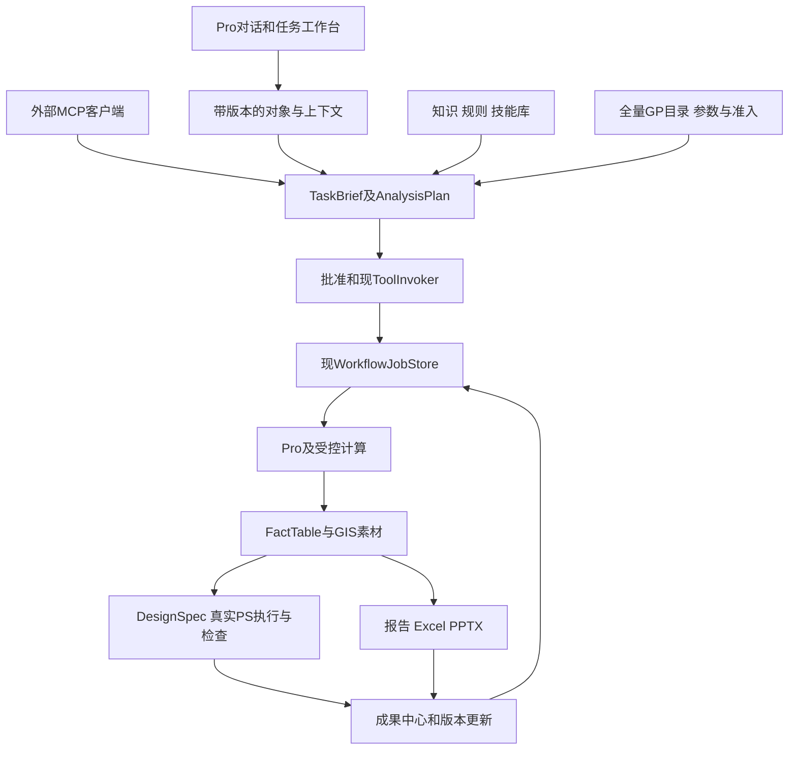

# 最终模块实现：产品入口、GP规模与自动成果

日期：2026-10-01。状态：设计交付候选。配套[最终方案](GIS_AUTOMATION_FINAL_PLAN_20261001.md)、[GP自动适配](GP_AUTO_ADAPTER_AND_SCALE_20261001.md)。本节英文名为拟议契约/服务职责，开发前与现模型去重，不暗称全部已经实现。

## 1. 统一架构与数据流

Shared仍无ArcGIS SDK；Host通过Compatibility和MCT接入；所有MCP工具在Composition唯一注册。产品包和技能库只是声明式资源/应用服务，不是第二执行器或注册中心。所有路径/端口/超时/预算集中配置。

现有 `ToolInvoker`、`ToolValidatorPipeline`、`WorkflowJobStore`、GIS素材和PS内部路由作为基础复用；按实际差距补批准范围、类型编译、Adobe队列、事实/设计、应用上下文和文档适配。不能直接把旧字符串GP序列化器升级为全量通道。

## 2. 20公共模块的本版职责

| 模块 | 实现与衔接 | 完成证据 |
|---|---|---|
| M01 能力目录 | 唯一Registry/285底册＋GP状态目录＋方法/技能索引；按任务渐进发现 | 命名、语义、算法、技能、环境分账，生成/源码/运行目录一致 |
| M02 数据语义 | 现元数据/质量工具＋ContextSnapshot/DatasetCandidate，身份/单位/时间/CRS明确 | 同名、缺CRS、项目切换、大选区和陈旧引用 |
| M03 质量治理 | 问题定位、修复副本、域/关系治理＋U11规范Schema/字段规则 | 数据级恢复、锁、前后符合性和未覆盖条款 |
| M04 任务编译 | 结构化表单/自然语言/技能生成同一TaskBrief和AnalysisPlan | 模型不存在的工具/字段不能执行；方法条件/依赖/输出明确 |
| M05 执行策略 | 现Invoker扩展task/context/approval引用；GP类型/effects/环境；PS批准与文档拥有关系 | 所有入口等价、只读/路径/许可/批准/审计和未知副作用 |
| M06 作业恢复 | 现Jobs/lease/fence日志接应用、GP和PS回执；intent→执行→检查→receipt | 超时不盲重发，取消确认、跨重启对账、控制操作可响应 |
| M07 空间/网络 | 现Native/GP＋X6；方法卡和事实表输出 | 真值/可行性/许可与失败，不把直线当道路求解 |
| M08 栅格/遥感 | 共同格网、波段/QA、X4登记模型、多维与资源限制 | 像元与分类真值、配准/NoData、参考精度、分块一致 |
| M09 符号标注 | 分类/色阶/单位/标签绑定事实和数据；科学颜色保护 | 图例与分类同源、中文/混排、密集标签与跨期一致 |
| M10 模板布局 | 36规格转可执行DesignSpec约束包，真实测量与用途合同 | 不无限缩字、不删类别；地图框/整饰与实际DPI检查 |
| M11 素材交换 | 已有设计包扩完整共同画布/原点/图框签名/hash | 分层配准、透明裁边、GIS矢量与PS栅格区别 |
| M12 PS连接 | 已有内部路由→实际UXP peer、生命周期、能力/权限握手 | 本机health不代替Adobe深探测，断线/重启/忙/token失效 |
| M13 UXP动作 | 真单写队列、固定动作和modal执行；拥有文档、重复请求、取消 | 真导入、文字、图例、预览、PSD/PSB保存重开和导出 |
| M14 自动设计 | Spec编译→候选筛选→真实预览→检查→有限RepairRule | 两类图0次PS编辑；科学硬门；无解/退步/预算停止 |
| M15 更新版本 | 强指纹、依赖图、Spec/Patch不可变revision；数据/规则/方法变更 | 已绑定事实同步、外部母版原件保护；默认全重渲染 |
| M16 检查交付 | 数值/地理/文件/视觉；ClaimBinding；Office与数据包真实验证 | 必需产物缺失、审计关键缺口不能报完整成功 |
| M17 产品工作台 | Pro DockPane/MVVM，U01–U08共用应用服务 | 标准任务不复制JSON、不强制外部聊天或PS手工操作 |
| M18 格式/提供者 | 现代格式、CAD/TXT/Excel、受控底图/历史影像/HTML适配 | 有限格式合同、合法来源、往返/语义损失，不能按自由字符串承诺 |
| M19 评测观测 | 现Benchmarks＋GP逐项证据＋产品/技能/规则/行业验收 | 阶段状态、费用/时间、失败/介入、专业与新手独立验证 |
| M20 安装交付 | 功能门后统一安装器与真实包测试 | 插件/资源/模式版本、实际安装发现、首图、升级恢复 |

## 3. 八扩展领域承接，不再从头计工

X1时序：时间政策、立方、变化点/趋势/预测、动画，统计条件和缺测明确。

X2三维：场景高程/拉伸、视域/通视/剖面/土方和交接，Z基准与已知答案。

X3点云：从已有限定LAS读取继续扩过滤、分类、DTM/冠层/跨期，LAZ/COPC分别验证。

X4遥感：产品QA、云影、分割、分类/独立精度、登记模型/时序，不用占位模型计能力。

X5科研决策：抽样、插值/空间验证、敏感性/误差传播、多准则/集合与适用条件。

X6网络：OD、最近设施、选址、车队、中断、成本面，各有真实数据和限制条件。

X7互通：标准一致性、垂直转换、离线与科学立方，按F03合并策略实现，不再注册被合并同义工具。

X8文档：FactTable→报告/PPTX；补WorkbookSpec/可追溯表格。新增格式与公开schema的关系必须变更审查，不能把CSV导出声称为XLSX。

## 4. 12产品包的具体实现

### U01 一体任务与对话工作台

Pro DockPane采用WPF/MVVM，显示数据/范围、对话、步骤、预览、成果五类内容。TaskApplicationService统一接受表单或模型提案，编译TaskBrief后调用现Invoker与Jobs。

核心契约：ConversationSession、TurnRecord、TaskCard、UiEvent。所有视图引用同一个taskId/jobId/specRevision。聊天文本、草稿计划、已批准任务、执行回执和检查结论分别存储；模型文字不能改变真实状态。

验收：无需技术参数抄写；表单无模型可用；关闭重开能找回任务；重复点击不重复写。技术诊断折叠给专业用户，不成为普通工作流的必经页面。

### U02 模型连接、预算与数据政策

ModelProfile包含provider/endpoint/modelId、流式/工具能力、token与输出预算、认证引用和数据政策。适配器把不同提供者响应规范化为TypedProposal，不让SDK差异进入GIS执行层。

ModelRequestEnvelope和UsageReceipt记录本次发送元数据/摘录/统计/图像的许可范围与消耗；secret由集中受保护存储管理，不入聊天、工程、日志或技能包。先支持一个实际可用的本地endpoint和一个远端适配；没有本地模型时仍可无模型表单，不随插件默认安装模型。

验收：无密钥、401/429、超时、流中断、坏schema、提供者切换；只重试语言请求，不重复GIS步骤。对话摘要压缩不覆盖执行账/FactTable/批准。远端对话与本机MCP公网监听是不同边界；MCP始终回环。

### U03 地图与持久会话上下文

ContextSnapshot记录project/map/layer稳定身份、可见/选择摘要、数据revision、时间/CRS与生成时间；ContextDelta显示与当前任务的变化。Compatibility适配读取SDK状态并生成DTO，Shared不持SDK对象。

现WorkspaceContext是进程级static，不能作为多任务/多客户端持久会话隔离机制。应用会话存于D盘拥有根，默认工作区只作显式建议。已批准任务固定自己的上下文；切图或改数据触发陈旧提示，不能暗改目标。

验收：同名地图/图层、重命名、删除、项目切换、重启和两个会话并行；陈旧对象错误写入为0。

### U04 地图点选、框选与空间指代

SpatialReferenceToken记录map/layer身份、范围/选择digest、数量和数据版本；用户看到@标签与范围。临时AOI优先用UI overlay；持久图层创建经工具与批准。

现选择每层OID读取上限10000且可Truncated，快照为会话LRU。任务级SelectionMaterialization必须证明完整集合：可用拥有的物化集合或条件/数据强指纹绑定，不能拿前10000当全部。“这里”“这些”“刚才那张图”绑定标签，不由截图或同名对象猜测。

验收：30组明确/歧义/陈旧指代，明确目标识别率目标≥95%，错误目标写入0；歧义集中一次呈现。

### U05 可视工作流与可控执行

将同一AnalysisPlan投影为步骤卡和依赖图；先做参数修改、可选步骤、成本/输出预览、暂停/取消/继续/分支，再做专家节点编辑。WorkflowPatch必须绑定basePlanRevision。

修改后重新类型/依赖/方法/范围检查；必要时重新批准变动范围。视图状态从工具与作业回执读取，不另建流程执行器，不允许任意Python节点。

验收：面板/MCP同计划参数、策略、产物一致；旧Patch拒绝；网络或模型失败后任务状态可恢复。

### U06 数据搜索、预览与接入

聚合现search_data、scan_data_folder、dataset_summary等为DatasetCandidate；显示格式、位置、覆盖/时间、字段、CRS、质量、来源、许可、可用性。ImportPlan说明副本/转换、输出和资源估计。

当前scan不涵盖所有Excel/CAD格式；通过M18固定adapter扩，不因搜索结果有后缀就宣称读写成功。远端搜索/底图/历史影像分别走提供者、网络和数据政策，不把默认AOI暗发服务。

验收：固定50例检索集Top5召回目标≥90%；多结果不取首项；无副作用预览，实际导入后质量/来源一致。

### U07 本地知识、方法与引用证据

DocumentIngestor抽取文本/段落/表格与sourceRef；EvidenceIndex先采用本地全文/关键词检索，向量检索是可选适配。MethodCard含方法/公式/假设/单位/输入/许可/来源版本；CitationRecord指向原文件hash和具体位置。

原文事实、解释推论、冲突与未知区分。引用必须支持对应解释；运行数值仍来自FactTable。索引文档和字段中的指令视为内容，不能改系统权限、自动执行或安装。

验收：引用定位、跨版本、未找到来源、无关引用、过期方法和提示注入。OCR/扫描件是需要实际验证的适配能力，无法可靠读的条款不猜。

### U08 成果中心、办公文件与通知

ArtifactStatus/DeliveryManifest管理地图、图片、PSD、报告、XLSX、PPTX、数据和版本；按钮打开/目录/加地图/预览/比较/更新。NotificationEvent来自完成/阻断/需决策的真实状态，带eventId去重；默认应用内，不自动邮件或外部群发。

ReportSpec、WorkbookSpec、PresentationSpec共用FactTable/ClaimBinding，采用经评审的Open XML/文档适配器。表格有字段/单位/公式/来源sheet；地图可用图片，承诺可编辑的文字/图表才验对应结构。PDF转换按真实支持通道测试，不暗含必装办公程序或LibreOffice。

验收：图表/报告/工作簿/PPT数字一致100%，已绑定旧数字更新残留0；文件真实重开，文字/公式/表格检查。任一必需格式失败则任务部分完成，不能绿色全过。

### U09 语义操作记录与草稿生成

SemanticActionRecord来自Invoker/作业事件，记录工具/参数/输入输出/版本/批准范围摘要和检查结论，不记密钥或屏幕坐标。Pro内非本系统操作只有在SDK历史/事件可证明覆盖后接入；观察不到的手工编辑留下RecordingGap，不声称所有鼠标动作都可回放。

WorkflowDraft泛化输入/路径/字段，把一次性OID、token、文档ID替换为稳定绑定；方法常量与用户参数分开。记录buffer 500米必须保留模型、CRS和单位前提，不能泛化为任意数据普遍适用。

验收：草稿、参数化、已验证、可发布状态分开；至少两个满足条件的不同新数据集回放并含负例；无旧路径和原批准泄漏。

### U10 技能版本库、复用和作者工具

SkillPackageManifest包含参数/输入合同、AnalysisPlan模板、方法卡、RulePack、设计模板、依赖锁、允许effects和ValidationSuite。技能加载是声明式解析，不执行安装脚本、不改白名单、不下载模型，不成为任意代码市场。

本地/项目/团队私有包优先；公共目录可作后续提供者，但来源、许可、权限与证据须审查。新版本不可变，显示参数/方法/模板差异；每次执行重新绑定数据和范围批准。旧任务可以固定旧版本，风格偏好不能携带无限写入权。

验收：跨工程/版本、缺依赖、旧Schema、被篡改包、失败回放、安全退役/迁移与回退；包可发现不代表当前可用。

### U11 文档规范到规则与Schema

NormSource保留原件hash、标题/地区/版本/生效范围。抽取后形成RuleCandidate，不直接执行。受限逻辑/Schema表达明确obligation、predicate、unit、exceptions、sourceRef、severity与verificationStatus。

“应/宜/可/不得”、不小于/不超过、单位、脚注/否定/例外、跨页表格必须不同处理。RuleDecision记录采用/冲突/不支持/需复核。已验证RulePack经方法/例题与坏例验证后，任务编译检查适用性，才用于建库、QC或布局。

首批由专业人员形成少量已验行业包；普通用户选择即可。临时新规范集中确认高影响歧义，不能把几百条审阅责任转给不会GIS/PS用户，也不能让模型默默猜对。公式只用固定算子/类型化表达式，不执行任意代码。

验收：≥30条标注规则，≥10条否定/脚注/单位/跨页陷阱，高影响误编译0；合规报告声明已检查条款与未覆盖条款，不笼统“符合全部规范”。

### U12 行业资源包与互通

DomainPackageManifest组合输入/字段映射、方法、已验RulePack、工具/GP计划、模板、合法素材、样例/负例/黄金输出和版本支持。包不能自行安装软件或修改系统；新算法归正式工具/GP批，新格式归M18adapter。

CAD符号输出需要Geometry/Symbol/Layer映射、CRS、单位和丢失项协议；报批坐标文本需要CoordinateTextProfile（来源版本、编码、精度、环方向/闭合/分组）和往返验证；Excel需要真实sheet/schema/日期/公式处理。既有GP53无这些全部转换通道，不能泛称已有。

先完成BP01/BP02两个完整行业包，再扩BP03–BP10。每包至少交正例、负例、规范变更或换期例及自动成果；业内名称不重复计60场景。

## 5. 关键契约怎么连起来

| 契约 | 最少身份与校验 |
|---|---|
| ConversationSession | sessionId/projectId、消息revision、数据政策，不持通用执行权 |
| ContextSnapshot | 工程/地图/图层稳定ID、selectionRef、dataDigest、产生时间；缺/陈旧状态 |
| TaskBrief/AnalysisPlan | 用途/方法/输入/输出/预算、types、DAG、effects；来自表单/模型/技能同校验 |
| ApprovalRecord | planDigest/input scope/output root/effects/budget/expiry；由服务端核对，confirm不代替批准 |
| GpCapability/Admission | 算法ID/metadata与compiler/policy版本、许可、参数域、验证证据；发现与准入分开 |
| JobReceipt | task/job/step/requestId/fence、intent和结果状态、artifactRefs；未知副作用可对账 |
| FactTable/ClaimBinding | factId、值/单位/分母、方法/时段/质量/来源；报告句子绑定其事实 |
| DesignSpec/Patch | 不可变revision、模板/字体/ICC、图框范围/旋转/像素、语义ID；旧Patch拒绝 |
| RulePack/SkillPack | 原件/方法/工作流/依赖/验证版本；本次输入与批准另绑定 |
| DeliveryManifest | 必需/可选产物、hash/路径/检查/缺项/限制；整体完成不能由聊天推定 |

例如“把这些社区做成汇报图”：对象标签→ContextSnapshot→TaskBrief→带明确方法的计划→批准→Invoker/GP→FactTable→DesignSpec→真实PS→CheckReport→DeliveryManifest。后续“改简洁”只改允许设计；“减少一处设施”改变分析并生成新计划。

## 6. PS真实业务的最低退出门

现路由/注册不能代替下列真实证据：

1. 指定Adobe版本的实际UXP peer，能力握手、文件权限与拥有文档身份。
2. 单写队列、modal动作、批准、过期/重复请求、取消和状态控制。
3. 实际导入素材→标题/图例/版式→预览→保存PSD→导出PNG/TIFF→关闭并重开。
4. 规划和科研两类最小模板各3输入，0次PS手工设计。
5. 宿主忙、回执丢失、token失效、退出重启、磁盘满；无重复副作用/覆盖原件。

语义分层素材可为栅格/智能对象，GIS真正矢量另交PDF/SVG。PSB、大画布、ICC/印刷各真实验证，不能靠PSD小图推定支持。

## 7. 自动设计、预算与更新

单页初始预算：结构候选≤12、首预览≤3、总预览≤5、修正≤2轮、最终渲染≤2次。批量按页数/像素事先形成一个总作业预算，不能每页重置为无界。参数在真实试验定标，不当现有性能。

科学硬约束先筛，审美再评分；字号/分类/比例/数值不为了通过而降标准。父组/全局调整、遮挡/裁边和非等比变换都检查。修正只从白名单RepairRule产生，失败签名重复/退步/预算耗尽停止。

跨Pro/PS/文件没有全局事务承诺；intent→调用→产物检查→receipt，未知先对账。强缓存键含内容/结构、工具/参数/CRS/方法/环境、模板/字体/ICC。首版默认完整重渲染生成新版，局部更新须通过等价性检查才优化。

## 8. 需要正式评审的变更清单

| ID | 变更意图 | 原因 |
|---|---|---|
| SC01 | 应用层会话/上下文/批准绑定 | 不能把进程static、聊天摘要或confirm当隔离和授权 |
| SC02 | 全量GP catalog视图与状态 | 现list_geoprocessing_tools承诺白名单外不出现，不能静默破坏 |
| SC03 | GP结构化参数/codec/effects/环境准入 | 现字符串split与output方向保护不能支撑2100目标 |
| SC04 | 可选Composition生成入口与分类manifest | 增加细粒度模式需唯一注册、动态effect分类、客户端承载与计数对账 |
| SC05 | 文档/Workbook/Office交付合同 | CSV不等于XLSX；需要新文件类型、可编辑性和验证策略 |
| SC06 | CAD/坐标文本/在线提供者 | 新格式或服务前提、GP/依赖、损失与预算明确 |
| SC07 | RulePack/SkillPack资源与执行规范 | 包是声明资源，不带任意代码或历史批准 |
| SC08 | Adobe真实业务与支持矩阵 | 注册/health不能代替动作、保存、恢复和设计质量 |

SC是设计评审项，不是新D工单，不自动授权软件安装、白名单变化或外发。既有授权按其范围持续，不重复询问。

全量GP执行还必须满足三项硬门：生成入口分类与准入manifest绑定，缺失/版本不符/条件effects未知时拒绝；有效环境和原位输入/派生输出/侧车/中转作用范围显式批准并隔离恢复；持久intent失败零执行，执行后receipt失败进入对账、不报完整成功或盲重试。旧run、compact与granular三入口同算法同参数策略一致。详见[GP规模工程](GP_AUTO_ADAPTER_AND_SCALE_20261001.md)。
