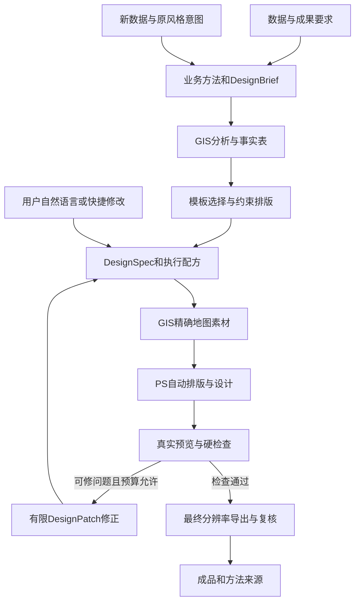

# ArcGIS Pro MCP：面向不会使用 Photoshop 用户的产品与创新方案 V5

日期：2026-09-27。状态：**设计建议 / 未实施 / 待正式分批派工**。

用户最新约束：“用户不会使用ps所以人工设计占比非常少”。据此调整产品主线：**系统承担分析、专业制图、自动设计、质量检查和交付，用户主要表达目标、查看结果和提出修改意见。日常完成任务不要求学习 Photoshop。**

保留数量与质量同时领先、GIS→PS全链路、规划汇报与科研两类成果、最终一键安装等目标。V5替代V4中“用户进入PS精修”的默认流程；V4已有GIS、安全、恢复等技术细则在无冲突处继续使用。历史文档不覆盖，正式工单和项目治理不因本方案改变。

## 1. 产品定位与工作分配

定位：**面向 GIS 成果的自动分析与设计工作台**。ArcGIS Pro负责空间数据和地理表达，Photoshop作为受控设计执行组件，产品面板展示任务、预览和成果。

| 工作 | 系统默认承担 | 用户承担 |
|---|---|---|
| 理解任务 | 匹配数据、方法和成果规格，提出必要歧义 | 明确用途；回答影响结论的关键问题 |
| 分析 | 数据检查、参数验证、运算、统计与来源记录 | 审阅业务方法和执行范围 |
| 设计 | 推荐模板、自动排版、配色、字号、图例、整饰、PS操作 | 可直接接受推荐稿；也可表达偏好 |
| 修改 | 将“标题大些、换成蓝色、图例放右边”等编译成受控改动 | 说结果要求，不操作图层或蒙版 |
| 质量 | 自动检查与有限修正，输出真实文件验证 | 对审美和业务适用性作最终判断 |
| 更新 | 用新数据重算和重新渲染，保留已选风格与文字意图 | 选择新的数据或时间期次 |
| 专家编辑 | 保留PSD/PSB及保护机制 | 少量有能力的用户可自选，不作为默认完成步骤 |

“无需PS技能”是产品验收目标；“无需PS主程序运行”“永久后台无界面”“从不出现任何权限提示”不作承诺。UXP是运行在Adobe宿主内的插件，面板和命令有不同生命周期，需测试实际PS版本的加载、隐藏、关闭和重启行为。[Adobe插件生命周期](https://developer.adobe.com/uxp/guides/explanation/concepts/panels-and-commands/)。

## 2. V4必须调整的地方

| V4侧重点 | V5决定 | 开发影响 |
|---|---|---|
| 生成素材后用户去PS精修 | 默认自动完成PS处理并把成品带回成果面板 | 自动排版/检查/修正进入M1完成门 |
| 展示多个候选，用户逐项调参 | 默认给1个推荐成品，最多2个备选折叠展示 | 排序与推荐由系统承担，不强迫逐步选稿 |
| 人工设计保留是主卖点 | 优先保留用户需求、风格选择和文字修改意图 | DesignSpec成为主事实源，PSD作为执行产物 |
| 任意PS修改的三方合并投入较大 | 先支持完全拥有文档的重渲染；外部修改保护必做，细粒度合并列专家增强 | 降低默认流程的身份匹配和冲突负担 |
| PS预览/校验工具在后续批次 | 底层预览、测量、文档校验服务必须提前实现 | 公开细粒度工具仍按原数量批次推出，不双算 |
| 质量依赖最后人工看图 | 每次渲染进入自动硬检查＋有限修正循环 | 增加质量规则、修复策略和真实视觉基准 |
| 失败后要求用户去PS修图 | 给重试、基础成图或保留版本等可理解操作 | 不把“自己去PS调一下”当标准恢复路径 |

## 3. 八项重点创新及可实现路径

### 3.1 成果需求编译

把自然语言或场景表单整理成 `DesignBrief`：用途、受众、媒介、页面尺寸、主图/附图、必需指标、风格、机构规范、输出目录。缺省采用可见的安全默认值；分析方法、距离模型、统计分母和数据来源不靠审美偏好决定。

AI客户端可解析语言，服务器以确定性规则检查并编译。第一版沿用已连接AI客户端；Pro表单与快捷修改按钮无需模型也能完成标准任务。不假设Pro内部已经有聊天模型，也不要求用户另开模型API账户。

### 3.2 自适应版式

模板定义信息结构与约束，不只定义固定坐标。系统根据研究区长宽比、图例项数、文字长度、地图框数量和信息密度选择布局家族，再计算槽位尺寸和位置。

先满足研究区完整、图例一致、最小字号、必需整饰等硬约束，再优化对齐、留白、层级和配色。内容放不下时自动换布局/增加获准附页，不能删关键类别、缩小到不可读或裁掉研究区来获取高分。

### 3.3 自动艺术指导与地理规则共同工作

“更正式”“科研简洁”“突出服务不足地区”分别映射到已定义的设计token、布局优先级和合法强调方式。标题、间距、装饰可自动调整；地图尺度、地物位置、量化颜色与统计含义受保护。

突出某类对象必须基于真实查询或结果；不能通过PS涂改地物、像元或显著性来满足视觉要求。

### 3.4 渲染—检查—修正闭环

流程为：生成候选→实际预览→结构与语义检查→发现可修问题→受限修正→重新渲染→检查最终文件。

首版修正限定于文字溢出、边界越界、图例槽位、字号/间距、合法字体替代和内容布局；地理方法/数据缺陷返回分析阶段处理。默认最多2轮自动修正，候选和时间/内存预算可配置，达到预算仍不合格则停在可解释状态。

视觉模型可以辅助评阅，不能担任唯一判官。无视觉模型时核心路径仍可用；对无法自动判断的外观问题保留未验证标记，不能把缺检查当通过。

### 3.5 通过意图修改成品

用户说“标题大一点”，系统生成可审计 `DesignPatch`，作用于标题字号而非全局文字；“图例放右边”触发布局重排，不覆盖主图；“只显示高风险区域”要先区分突出显示与数据过滤，必要时澄清方法范围。

修改绑定当前预览revision，避免把旧意见应用到新数据。用户能撤销一次修改或恢复已选版本；微小安全样式改动在已批准范围内执行，不反复索要确认。

### 3.6 保存“设计意图”，自动生成下一期

主事实源是数据与方法、DesignSpec、已接受的DesignPatch、风格配置和成果历史。替换新数据时重算依赖，再按保留的意图生成新文档，不要求用户打开旧PSD替换图层。

如果发现外部人员改了PSD，保留原件并另存新的自动版本；不能证明没改过时同样不覆盖。专家三方合并继续规划，但不阻塞普通用户的安全重渲染。

### 3.7 一次任务、多种用途交付

同一分析结果可生成规划汇报版、科研插图版、屏幕预览和打印版；各自有真实布局和输出规则。A3改竖版不能只把已有PNG拉伸；应基于DesignSpec重新排版并检查比例与文字。

GIS矢量PDF/SVG和PS栅格成品按实际格式能力分别交付，不能把PS输出PDF一律说成保留GIS矢量。PSD/PSB保留给未来或专家，普通用户直接拿可用成图。

### 3.8 显式偏好复用

用户可点击“保存为本项目风格”，保存已接受的颜色、字体层级、标识和布局偏好；记录作用域与版本，可撤销。不会因为一次喜欢蓝色就偷偷改变所有工程，也不把未知字体/机构模板自动下载或安装。

## 4. 用户完整流程

### 4.1 初次准备与日常生产分开

首次准备：安装最终插件→环境检查→必要时启动PS并启用连接→选择D盘工作目录→完成官方权限/配对→跑示例。该过程由引导完成，不要求用户理解UXP、端口、图层和JSON。

主程序启动、插件自动加载/可引导启用的实际能力需要F阶段验证。不能把首次配置摩擦藏在“零点击”宣传里。

### 4.2 日常生产：四步

1. **给数据、说用途**：例如“做设施500米覆盖分析，出A3汇报图和科研插图，自动美化”。
2. **确认关键方法与输出**：系统集中展示直线/路网、分母、目标文件与处理范围；合理默认值无需逐个填写。
3. **查看成品或提出修改**：系统已经完成分析、自动设计、检查；默认展示推荐稿，可说“更简洁”“标题改成……”或直接接受。
4. **取用成果**：输出成图、GIS结果、方法与来源说明，并可附PSD/PSB。下一期选择“换数据生成新版”。

默认路径中不存在“去PS调整图层/蒙版/色阶”的必经步骤。当前一键审批只覆盖已经明确的范围；改变分析方法、外发/发布数据或覆盖旧文件需要对应的新范围确认。

### 4.3 界面调整

顶层优先展示“任务、预览、修改、成果”；数据问题在任务中按需展开。PS连接状态放在“设计引擎”状态卡，不把图层树作为主界面。

快捷修改建议：“更简洁”“标题更醒目”“图例更紧凑”“换成科研风格”“换竖版”“恢复上一版”。具体可用项取决于模板与能力；不支持的动作不显示为可点击承诺。

自然语言修改发生在现有AI客户端；Pro内提供同等含义的按钮和表单。以后若做Pro内聊天，要另行设计模型/客户端集成，不把它写成现有能力。

## 5. 两种运行情况

| 环境 | 默认行为 | 用户看到什么 |
|---|---|---|
| Pro与PS均就绪 | 自动完成已支持的GIS→PS→检查→导出 | 推荐成品和已完成状态，不需要设计操作 |
| 没有PS/PS未连接 | 可完成原生GIS成图；需要PS的任务等待连接或显示基础版结果 | 明确哪些PS效果和母版未完成，不伪报全链成功 |
| PS被用户其他操作占用 | 等待/有界重试，允许取消或稍后继续 | “设计引擎忙”，不强杀用户进程 |
| 字体/效果不受支持 | 在预先批准的替代清单内重排；否则提示选择可用风格 | 展示替代影响，不让用户手工修字体 |
| 自动排版没有合格解 | 换获准布局或附页；仍无解则保留结果并说明缺口 | 简单可行动选项，不交假合格图 |
| 发现外部PSD修改 | 保留旧文档，自动另存新版；专家可选进一步比较 | 无需逐层解决冲突才能取得新版 |

PS作为自动执行组件仍有宿主模态限制；不同插件的修改不能任意并行，必须排队并支持取消。[Adobe executeAsModal](https://developer.adobe.com/photoshop/uxp/2022/ps-reference/media/executeasmodal)。

## 6. 技术结构

仍保留唯一Registry、Router/公共执行入口、Host隔离、MCT、受控GP和D盘资产边界。自动修正属于已批准范围内的有限子任务，不能绕过只读模式或静默扩大写入。

## 7. 工具数量与质量目标

本轮静态复核仍为154注册调用、33错误码常量、GP白名单53项；没有重验安装位或LIVE，不推进基线。

- 基准工具目标仍为154→175→210→240（最终GIS/工作流220、PS20），原86新增候选分16小批。
- 自动设计增加的是需要真实开发的公共服务、规则与体验工作包，不用“智能设计”“自动设计”“一键设计”等重复封装凑工具数。
- 原20个PS工具继续保留作为AI/系统执行能力；用户不会PS不意味着后台只需要少量粗糙动作。
- 30场景、20模板目标保持；模板验收从“可供人工精修”提升到“标准输入自动生成可交付成品”。
- GP100/150及竞品Q-DELTA仍逐名评审。240不等于已经全面领先；冻结对标范围、独立语义覆盖和实测质量另验。

### 7.1 新增验收指标（目标，非现状）

| 指标 | 定义与目标 |
|---|---|
| PS人工设计操作 | 所有宣称自动完成的标准路径中为0；打开应用/授权单独记首次配置摩擦 |
| 自动合格率 | 最终标准60样例须60/60自动通过，首次无需修正率目标≥90%；另设冻结压力集，最多2轮修正后成功率目标≥95%；同时报告全尝试结果，失败不能消失 |
| 严重错误 | 错坐标/错单位/错分类图例/错数字/数据破坏为0容忍，不能被美观评分抵消 |
| 对话修改 | 常见样式意见不要求专业PS术语；方法变更识别准确，不能把视觉修改误变成数据过滤 |
| 用户操作量 | 标准场景默认只需数据/用途、关键确认、可选改稿、取用；记录业务追问与异常，不硬承诺任何任务固定四次点击 |
| 视觉品质 | 两名独立制图/设计评阅者按冻结量表评阅；自动检查不能代替开发期专业审阅 |
| 新手可用性 | 最终招募8–12名无PS经验用户试测；不靠设计师现场代操作完成 |
| 复现与更新 | 同规格、同输入可重现方法与版式；数据更新后保留批准的风格和文本意图 |

60标准样例=20模板×3种输入/复杂度，最终全部必须在最多2轮修正内通过；压力集独立冻结，失败计入报告。不能事后把失败的标准样例移到“压力/不支持”组改善成绩；范围确需变更须明确裁定。关键质量缺陷不因压力集通过率达标而放行。

## 8. 开发优先级重排

**提前到M1**：成果需求、约束排版、自动推荐、真实预览、自动检查/有限修正、自然语言/快捷改稿、自动导出、新手引导、安全整文档重渲染。

**M2加强**：多尺寸重排、项目风格复用、方案比较、密集图例/长文字处理、批量一致性；PS细粒度工具与数据治理继续扩展。

**专家增强**：任意外部PSD的细粒度合并放在默认自动链稳定之后；外部修改检测、原件保护和另存新版本仍是M1必需项，不能延期。

**M3**：专业空间/栅格/出版/互通以及对标补差，所有新增成果都接入同一自动设计检查链。

全功能与新手验收通过之后，才开发最终统一安装器扩展、制作一键候选包、做实包部署与恢复验证。

## 9. 本轮交付

- [V5模块与自动设计实现](GIS_TO_DESIGN_AUTOMATION_IMPLEMENTATION_V5_20260927.md)：20模块改动、自动设计状态机、排版/修正/改稿算法和保护机制。
- [V5开发计划与验收](GIS_TO_DESIGN_DEVELOPMENT_PLAN_V5_20260927.md)：前置试验、自动化工作包、16工具批、质量门和容量重估。
- [V4模块细则](GIS_TO_DESIGN_MODULE_IMPLEMENTATION_V4_20260927.md)：继续沿用的底层技术参考；默认用户流程以V5为准。

本轮仅形成设计文档，不修改产品码、现役工单或安装配置，不制作新一键包。自动设计质量、无需PS操作和各项指标均需实现后实证。
