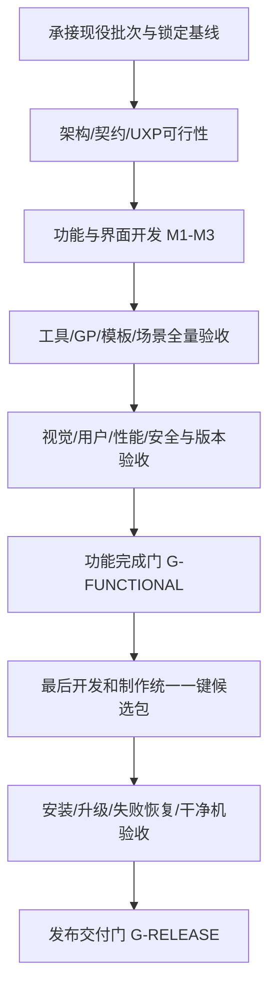

# ArcGIS Pro MCP：完整开发与最终一键交付计划 V3

日期：2026-09-27。状态：**开发总计划建议 / 待现任指挥席分解派工；本轮仅制定计划**。

用户本轮明确要求：“制定完整的开发计划……和之前一样使用插件形式可以一键安装吗？如果可以，在全部完善后再制作一键安装包”。本计划据此锁定顺序：**先完成全部功能与产品验收，再制作新的统一一键候选包，再验证该包的安装/升级/恢复，最后交付**。

不在本轮启动开发、真实安装、客户端配置写入、依赖安装或制包。不修改现役工单状态，不覆盖历史Release/r15–r20，不自行分配D编号。当前读取的D-079仍为ACTIVE，须由其派单方完成裁定/正式移交后衔接。

## 1. 已确定的目标与文档关系

产品目标：数量、质量与完整使用体验同时领先。交付形态：**ArcGIS Pro主插件 + Photoshop可选配套插件 + 同一安装入口**。用户通过现有AI客户端和Pro内任务面板，完成数据→计划→分析→地图→PS精修→检查→交付→更新。

| 内容 | 依据与目标 |
|---|---|
| 总体策略与用户流程 | `GIS_TO_DESIGN_FINAL_STRATEGY_V2_20260927.md` |
| 第一波逐工具规格 | `GIS_TO_DESIGN_TOOL_SPECS_20260927.md`，21件 |
| 后续逐名候选、场景与模板 | `GIS_TO_DESIGN_CAPABILITY_BACKLOG_V2_20260927.md`，65件、30场景、20模板 |
| 本计划新增内容 | 完整WBS、依赖、模块、交付物、测试门、部署形态及制包时点 |
| 数量 | 154→175→210→240；旗舰GIS/工作流220，PS20 |
| 受控GP | 53→100→150，独立能力扩展目标；不能与240混加 |
| 质量 | 对应版本运行证据、完整回归、24核心场景×至少3轮、5隐藏变体、用户与视觉验收 |

优先级：用户最新指令 > 正式派工/项目治理规则 > 本V3实施顺序 > V2产品路线 > 首波规格/其他参考。本文不是对全部新增白名单、风险操作或发布行为的一次性授权。

240是待实现候选目标，尚未验证的接口不得计入正式支持。候选重叠/API不可达时应合并或替换有价值能力并留痕；没有达到数量门就不宣称达标。

## 2. 是否仍可一键安装：结论与实际形态

### 2.1 可行性结论

**可以继续采用插件，并设计成一个安装入口完成本产品组件部署。** 不需要把产品改成独立GIS软件或让最终用户安装开发环境。

本轮只读核对：`scripts/one-click-setup.ps1`已经包含Plan/Preflight/Deploy/Retry/Diagnose/Recover等路径，并按Pro版本选择net6/net8 payload；安装/客户端变更委托既有事务脚本。可以复用其思路与已验逻辑，新增PS组件、资源与新版能力矩阵。旧 `ONE_CLICK_DEPLOYMENT_PLAN.md`仍含r5历史口径，不能作为最终新包版本事实。

Esri提供`.esriAddInX`插件安装与管理机制；Adobe支持独立`.ccx`插件安装，以及UPIA命令行部署。**统一入口可行，但本产品双插件联装尚未实测，不能保证所有机器零确认、零重启、零管理员权限**。[Esri管理Add-in](https://pro.arcgis.com/en/pro-app/3.3/get-started/manage-add-ins.htm)、[Adobe安装UXP插件](https://developer.adobe.com/uxp/guides/how-to/distribution/install/)。

### 2.2 安装包组成

| 组件 | 形态 | 是否必需 | 说明 |
|---|---|---|---|
| ArcGIS Pro主插件 | `.esriAddInX` | 必需 | 工具、任务面板、GIS宿主适配、MCP服务 |
| Photoshop配套插件 | `.ccx` | PS功能必需 | 受控UXP适配、PS状态/设计操作/预览 |
| 模板与配方 | 版本化资源 | 标准包包含 | 两类模板、30场景的配置及许可说明；素材许可独立核验 |
| 本地必要运行组件 | 随插件或独立受控组件 | 按最终架构 | 优先不增加独立服务；如确需组件则纳入安装manifest/版本/恢复 |
| 安装与恢复入口 | 延续Windows启动器+界面 | 必需 | 环境预检、组件选择、事务安装、诊断、修复/卸载 |
| 教程与示例 | 文档+可分发样例 | 必需 | GIS-only与GIS+PS两条上手路径 |

正式包不包含ArcGIS Pro、Photoshop、Creative Cloud本体、第三方许可证、开发SDK、用户数据或凭据。宿主未装/未许可时明确提示条件；不自动安装商业软件，也不绕过授权。

普通用户安装正式`.ccx`不走开发者加载流程；开发人员可按Adobe规范使用UDT开发/打包。独立分发与Marketplace的插件ID政策分开，不以“能生成zip”替代有效CCX。[Adobe打包说明](https://developer.adobe.com/uxp/guides/how-to/distribution/package/)。

### 2.3 用户最终安装流程

1. 双击统一安装入口。
2. 检测Pro版本、Photoshop/Creative Cloud或UPIA、可用权限、运行中宿主、磁盘和旧版本。
3. 选择“GIS核心”或“GIS+Photoshop设计”，选择D盘工作目录及一个需要配置的AI客户端。
4. 展示组件版本、安装目标和将修改的配置，用户确认；缺PS时允许只装GIS，不误报设计功能已就绪。
5. 安装器选正确Pro payload、安装PS CCX（如选中）、部署资源，逐步骤记账。
6. 必要时引导Adobe安装确认/权限确认；不绕过官方对话框，不强杀用户进程。
7. 引导开启宿主，做实际MCP/PS握手与小型只读诊断，显示逐组件状态和下一步。

“一键”指一个入口、一个清楚的安装向导，不要求用户手工复制文件、改JSON或搭环境。系统/Adobe要求的确认不承诺消除。UPIA是否能在目标环境完成自动安装，放到最终部署验收中证明；不可用时同一向导引导官方CCX安装并回读结果。

## 3. 全部完善之后才制包：阶段门



**G-FUNCTIONAL之前不制作新的面向用户一键分发包，不循环发布r21/r22试用包，不做新安装器实装/干净机部署项目。** 可以先记录安装需求、插件ID/版本契约与文件布局约束，防止产品做好才发现无法分发。

开发所需构建、测试程序集、内部`.esriAddInX`和UXP开发加载是功能验证载体，不是统一分发包；必要的真实开发环境安装仍由正式工单与单独授权约束。对旧种子执行`dotnet clean`仍禁止。不能用“最后才制包”取消必要LIVE测试。

功能通过后，才开始安装器改造与统一候选包制作；安装/干净机验收必须使用这个实际候选包，不能放到制包前形成循环依赖。若发现产品缺陷，回到功能门修复并重验，随后重建候选；不是把缺陷带进最终交付。

## 4. 模块边界与拟改动位置

下面标“新增”的模块只作为规划，正式名称/目录在架构工单中确定。

| 模块 | 现有位置/拟新增位置 | 职责与边界 |
|---|---|---|
| 工具与计划适配 | `Source/Shared/ArcGISProMCP.Tools` | 工具schema、输入验证、对宿主与作业服务的调用；避免继续把全部状态持久化堆在单个FolderWorkflowTools文件 |
| 领域/作业/产物契约 | `Source/Shared/ArcGISProMCP.Core` | ProcessingPlan、作业状态、Capability视图、Artifact/Design契约；不引用ArcGIS SDK |
| GIS宿主与Pro面板 | `Source/ArcGISProMCP.Compatibility` | IArcGISHost实现、SDK访问与MCT调度、Pro原生UI；参考Config.daml扩展界面 |
| 版本构建 | `Source/ArcGISProMCP.Current`及现有构建配置 | 宿主代际的实际职责先核实，不假定只改TFM即可跨版本 |
| MCP协议/服务 | `Source/Shared/ArcGISProMCP.Protocol`、`Server` | 保持已用客户端兼容；传输/取消/状态通知能力逐项核验 |
| 安全/配置/日志 | Shared下Security、Configuration、Logging | 允许根、确认、会话配对、超时/资源上限、审计与脱敏 |
| PS领域边界 | Core内新增ICreativeHost等无宿主类型契约 | GIS与PS分别适配，禁止在Shared引入ArcGIS SDK或把PS当ArcGIS服务 |
| UXP插件 | 新增`Source/PhotoshopPlugin/`（拟） | 有限命令handler、模态队列、文档身份/版本、配方、保存/预览与权限 |
| 模板/场景资源 | 新增`Resources/Design/`、`Resources/Workflows/`（拟） | schema版本、许可、输入契约、预览、样例与测试基准 |
| 安装器（最后） | `scripts/one-click-setup.ps1`及既有事务/恢复入口 | 多组件安装与能力矩阵；不将全系统操作压成不可追踪的一条脚本 |

唯一注册中心仍为Composition.BuildRegistry。任何新架构分支/桥接通道必须评审；不新增任意Python/JSX/batchPlay执行面，不复用6511旁路，监听仅回环。文档和图层元数据作为数据处理，不成为可执行指令。

## 5. WBS：前置开发工作包（零新增工具）

这些编号是本计划内部编号，不是D工单号。实际派工时重新枚举防撞号。

| 工作包 | 前置 | 工作 | 交付与退出条件 |
|---|---|---|---|
| F01 基线承接 | D-079裁定/移交 | 核源码、安装位、包内/外manifest、工具/白名单/错误码、锁和未结项 | 基线矩阵，差异逐项解释；不把源码154当两代运行事实 |
| F02 竞品与能力冻结 | F01 | 固定对标版本；86候选语义去重；当前宿主/许可/PS版本采集 | 工具差距表、240计数账、版本支持策略；API不明标VERIFY |
| F03 契约/安全设计 | F02 | Capability/Plan/Artifact/Design四模型、状态机、授权绑定、所有者语义、受限PS通道 | 架构ADR、schema、数据迁移/错误映射、安全边界经指挥席评审 |
| F04 PS与分层可行性 | F03 | 最小UXP握手、中文文字、智能对象/分层定位、模态取消、保存/重开、字体/ICC行为 | 真实目标版本证据；不支持项降级；正式CCX发行留到最后 |
| F05 测试数据与基准 | F01-F03 | 24核心+5隐藏用例、已知答案、合法可分发样例、GIS/PS图像基准 | 数据来源/许可/哈希/容差齐全，独立每轮资产根 |
| F06 作业基础改造 | F03、D-079已验 | 抽离作业服务与存储、保留旧断点、状态原子化、取消控制路径、依赖与幂等基础 | 旧行为回归、异常中断恢复；不得先改坏现有工具再补测 |
| F07 面板基础 | F03/F04 | Pro内数据/任务/地图/设计/成果五区、视图状态、预览、错误与继续入口 | 用已验工具跑一条最小任务；不新造独立网站或第二执行链 |

F04失败可缩小PS版本支持或更改受控适配实现；若核心导入/保存/刷新不可实现，则M1不得宣称闭环。单ACTIVE不阻止同一批内部并行只读研究，但写入归属明确、集成后由独立验收方复核。

## 6. WBS：M1通用闭环（21新工具，累计175）

每批同时交付工具、面板操作/状态、示例、证据与文档，不能把UI全部积压到最后。细项schema见首波规格附件。

| 批次 | 新增数 | 工具范围 | 前置 | 本批用户体验与验收 |
|---|---:|---|---|---|
| B1 可靠控制 | 4 | list_jobs / cancel_job / validate_plan / describe_tool_catalog | F03/F06/F07 | 看计划、查历史、取消、清楚能力范围；取消竞态、旧断点和多所有者保护 |
| B2 质量制图 | 6 | get_geometry_info / find_identical / generate_quality_report / set_layout_element_properties / set_label_properties / configure_map_series | B1、F05 | 质量报告、图面调整、系列图；方法/单位/图例/页名无误，至少10页逐页检查 |
| B3 GIS→PS | 6 | export_design_bundle / validate_design_bundle / ps_get_capabilities / ps_import_design_bundle / ps_apply_design_recipe / ps_export_deliverables | B2、F04 | 两类成果各一条可重跑链，可重开PSD/PSB；分层配准、忙态、取消、保存失败 |
| B4 刷新交付 | 5 | refresh_design_bundle / ps_refresh_design_bundle / validate_delivery_package / suggest_workflow / get_performance_stats | B3 | 换数据保留User_Custom；三方冲突拒覆盖；成果清单和性能可见 |

并行伴随（不增工具数）：get_job_report多产物完整性、现有dryRun共享校验、审计关联、目录生成、run_batch确认与只读语义。涉及既有schema/语义的增强先审，不因“只加字段”跳过评审。

**G-M1**：源码175候选全部按本机能力表归档；规划3套/科研3套模板；首次完成、人工修改、换数据更新三种路径均通过。工具与契约一致；PS未就绪时GIS仍可用。此时仍不制作一键分发包。

## 7. WBS：M2专业广度（35新工具，累计210）

| 批次 | 数量 | 对应backlog | 前置/验收重点 |
|---|---:|---|---|
| P1 几何与变化检查 | 5 | Q01–Q05：几何验证、拓扑、几何重复、数据diff、schema diff | B2；预定容差与已知错误数据，修复/检测不混标 |
| P2 约束与来源 | 5 | Q06–Q10：字段约束、栅格对齐、地理转换、依赖、来源链 | P1及artifact契约；未知历史不伪造，格网缺失明确 |
| P3 域治理 | 5 | G01–G05：域创建/修改/删除/绑定/解绑 | P2；Schema锁、引用关系、数据级恢复、缺确认和只读拒绝 |
| P4 结构治理 | 5 | G06–G10：子类型、关系类创建/校验、几何属性、定义投影 | P3；数据库类型/版本/许可逐项验证，不在用户原库试错 |
| P10 PS观察 | 5 | P01–P05：文档/图层列表和详情、预览 | B4；目标文档稳定ID，读取不改变用户活动状态，预览资源预算 |
| P11 PS版本与调整 | 5 | P06–P10：校验、文档快照/恢复、图层属性、调整层 | P10；新文件恢复、保人工修改、定量颜色保护、取消不损母版 |
| P12 PS精修 | 5 | P11–P15：蒙版、文字、素材、画板、版本对比 | P11；字体/画布/模板规则、模态冲突、保存重开 |

建议串行派单顺序可依据PS与GIS开发资源调整，但各自依赖必须满足；不得让两个批次同时修改同一作业/manifest契约。

**G-M2**：210=190 GIS/工作流+20 PS；规划/科研模板累计各8套；高风险治理与PS母版恢复有反例；首波流程全部回归。仍不制作一键分发包。

## 8. WBS：M3旗舰能力（30新工具，累计240）

| 批次 | 数量 | 对应backlog | 前置/验收重点 |
|---|---:|---|---|
| P5 高级空间 | 8 | S01–S08：简化、平滑、邻接、格网、服务区、路线、自相关、热点 | M2；许可/路网/参数/统计显著性；真实路网不得用直线冒充 |
| P6 栅格 | 8 | R01–R08：重投影、金字塔、重分类、提值、分区频次、波段、变化、像元查询 | P2；语义去重、NoData、像元对齐、位深、内存/取消、文件侧车副作用 |
| P7 地图出版 | 8 | C01–C08：模板导入/导出、布局复制/删除、地图框、图例、比例尺配置 | B2/B4；多地图框、固定比例/北向、模板依赖、印刷/屏幕预览 |
| P8 远程数据 | 3 | I01–I03：发现、描述、导入远程数据 | F03安全扩展评审；提供者白名单、凭据脱敏、分页、限制大小、来源许可 |
| P9 数据交付与发布 | 3 | I04–I06：导出/校验数据包、发布地图服务 | P8/P7；公开范围单独确认、失败部分发布可恢复、包不漏依赖 |

**G-M3**：240=220 GIS/工作流+20 PS；30场景、20模板有正式样例与证据；本阶段仍只形成开发/测试载体，不制作最终统一一键包。

## 9. 工具之外不可遗漏的工作轨

这些工作不增加240计数，但没有它们不能称“全部完善”。

| 工作轨 | 时点 | 交付物与完成门 |
|---|---|---|
| GP-01 现有53核验 | F02→M1 | 真名、参数、许可、destructive、守卫、审计、目标环境实测清单 |
| GP-02 扩至100 | M2内按需求 | 先列名去重与风险审查，再批次扩容；源快照diff+包内语料双锚+LIVE代表与边界 |
| GP-03 扩至150 | M3内按需求 | 同上；未列名/未授权的条目不加入；同算法不重复计覆盖 |
| UX-01 全流程体验 | F07→M3 | 任务状态/进度/预览/可恢复错误/可读计划；专业参数只在需要时展开 |
| UX-02 模板库 | M1六套→M2十六套→M3二十套 | 每套至少两份不同输入验证，附来源、适用条件、字体和配色规范 |
| WF-01 场景配方 | M1起贯穿 | 30配方全部版本化、可预检、与真实能力目录一致；依赖明确 |
| DOC-01 产品文档 | 每批同步 | 快速开始、逐工具、两类教程、FAQ、版本能力表、恢复说明、许可清单 |
| SEC-01 威胁与负例 | F03→M3 | 计划授权/路径逃逸/重放/跨文档/模板注入/凭据/外发数据/会话归属 |
| PERF-01 性能 | B1起 | 小/中/大数据集，p50/p95、内存/磁盘、并发、队列、取消与恢复；环境和样本可复现 |
| COMP-01 版本 | F01→M3 | net6维护/功能范围，net8目标Pro版本，PS/UXP最低与最高已测版本；未测不推定 |
| RES-01 恢复 | B1起 | Pro崩溃、PS关闭、磁盘满、进程中断、取消五类故障；不重复非幂等写入 |
| OBS-01 可观测 | B1起 | 工具/作业/宿主/产物关联、日志脱敏、支持诊断包和保留政策 |

GP100/150是用户评审中的产品目标，不是已经授权的具体白名单变更。若受限于许可/API/价值而无法满足目标，应在功能门前作明确范围裁定，不能暗中把可发现数量充当可执行数量。

## 10. 每份正式工单的统一模板

1. 任务目标和用户可见变化；所属里程碑、前置工单与允许修改面。
2. 精确工具名/数量变化，逐名去重结果；无新增则明确0。
3. 参数/响应/错误码/读写/确认/许可/目标版本契约；修改旧契约的兼容政策。
4. API与GP/UXP spike依据，未知点及失败后的降级/停等条件。
5. 输出路径、独立测试资产、源码/包/安装位前照；受保护资产列表。
6. 测试矩阵、已知答案、质量与性能门槛、反证及恢复方式。
7. UI/模板/文档同批交付要求。
8. 报告位置、evidence-index、每项证据hash/时间/版本、未验证项。
9. 执行只交PASS CANDIDATE；指挥席独立复算后裁定。产品码或安全/契约变化超出范围则停等。
10. 明确“本批不生成新统一一键包”，直到最终打包工作包解禁。

构建遵守AGENTS环境变量与build-server纪律，保护旧bin种子；如需全量清理只能在经确认的独立开发构建目录，并以当轮授权为准，不对当前工作区直接dotnet clean。新参数、白名单、真实安装、GIS写入和用户配置均按实际授权边界执行。

## 11. 功能完成门 G-FUNCTIONAL

必须逐项有证据，未达项清楚列出，不以“总体进度100%”代替：

- [ ] 当前发布分支的工具/契约/目录/实际运行注册一致；240数量目标或用户正式裁定的替代范围明确。
- [ ] 对外声称支持的每个版本与许可组合有能力矩阵，未测范围标NOT VERIFIED；net6不套用net8工具数。
- [ ] 全量回归零产品性失败；新失败不能仅以属于某旧族为由豁免。
- [ ] 新增工具正负例与目标环境证据完整；写操作覆盖缺确认、只读、受保护路径、输出存在、取消和失败恢复。
- [ ] 24核心用例各≥3轮，5隐藏变体；完成率目标≥95%，无未披露重大数据/单位/尺度/图例错误；每个宣称支持的场景均有通过记录。
- [ ] 30配方、20模板完成；没有空壳/重复换色凑数，样例可分发且来源清楚。
- [ ] GIS→PS首次导入、手工修改、数据刷新、冲突处理、重新打开PSD/PSB全部通过。
- [ ] 规划/科研图件逐页/逐图视觉检查；沿用指南针/比例尺/图例/路径要求；需要例外的模板明示。
- [ ] 至少5目标用户完成首次任务、修改、更新测试；记录人工步骤/时间；体验目标未达则返回修订或正式披露裁定。
- [ ] 安全、资源预算、异常恢复和日志脱敏通过；UI无死路、错误可行动。
- [ ] 文档、许可清单、版本策略、数据迁移与支持说明齐全。
- [ ] 所有功能性P0/P1阻断归零；其余已知限制由所有者明确接受并体现在能力目录，不能偷偷删范围。

达到此门才允许开启R系列统一打包工作。安装器尚未开始不妨碍功能门通过，因为安装验收在下一门；也不能在功能门通过时就声称可一键稳定部署。

## 12. 最后阶段：统一一键包与交付

### R01 · 安装器实现与最终分发契约（G-FUNCTIONAL之后）

复用既有启动器/事务/恢复框架，补PS检测与官方安装适配、资源版本、用户选择、组合状态机。最终版本号、文件名、签名策略与支持表在此冻结，不预占r21或继续强用1.0.2。

开发前将已核验产品组件固定为只读发布输入，防止安装器测试中偷偷重建payload。统一manifest记录每件的版本/哈希/长度/目标宿主/许可/依赖/安装器版本/模板与配方版本。

安装计划先显示真实路径；项目临时/日志/备份/素材落D盘。官方Pro安装位及Adobe管理目录涉及的C盘写必须逐项列为安装例外并按用户授权执行，不能默认G-138例外已涵盖Adobe全部目录。

客户端配置复用Plan/Validate/Apply/Restore与逐字节恢复、基线hash和STALE_BACKUP_REFUSED；只改用户选中的配置，不全客户端ApplyAll；令牌不进包/日志。

### R02 · 生成统一候选包

建议保持熟悉的“ZIP解压后双击安装”方式，包含一个清楚的安装入口；若后续选择签名EXE，仅改变外壳，不改变事务与manifest验证。用户不需要SDK/Git/Visual Studio或UDT。

示意结构（不是本轮创建路径）：

```text
ArcGIS-GIS-Design-OneClick-<final-version>-Windows-x64.zip
  安装.cmd
  安装说明.md
  bundle-manifest.json
  payload/arcgis/<supported-variant>/*.esriAddInX
  payload/photoshop/*.ccx
  resources/templates/
  resources/workflows/
  scripts/安装与恢复组件
  docs/版本支持与教程
  samples/可分发样例
  licenses/NOTICE与依赖许可
```

仅打包已冻结的组件；不带用户工程、fixture、凭据、SDK、旧备份、未知锁或历史开发证据。Pro插件与PS插件的包格式各用适用工具生成，外层manifest逐件验证；不能手工拼CCX后假定可安装。

确定性验证分层：自己可控的归档要求稳定枚举/内容/时间策略与双次构建比对；Adobe工具生成的CCX或签名可能含不可控元数据，先验证其生成行为，不能无证据承诺整个最终ZIP二进制可复现。每个最终发行文件的实际哈希仍必须固定并归档。

### R03 · 实际候选包部署验收

| 用例 | 通过条件 |
|---|---|
| 干净环境GIS-only | 环境已有合法Pro、无本项目插件；正确选择payload、首次连接成功，无PS也清楚可用 |
| 干净环境GIS+PS | 合法Pro/PS及所需Adobe安装通道；两插件实装、实际握手与示例完整成功 |
| 从已支持旧版升级 | 保留用户数据/设计/配置；版本选择正确；旧断点政策符合文档 |
| 重复安装 | 幂等或明确修复，不重复配置/重复安装注册 |
| Pro成功、PS失败 | 显示PARTIAL而非全成功；可重试PS或明确回滚选定组件，不破坏已可用GIS |
| 客户端配置失败 | 主插件状态与客户端状态分开；不掩盖连接未完成 |
| 取消/断电式中断 | 重启安装器能读事务状态；不覆盖较新用户修改；回滚有hash证据 |
| 卸载/恢复 | 只移除本产品所有组件，默认保留成果与母版；恢复既有配置前防陈旧备份 |
| 特殊环境 | 中文/空格路径、非管理员、权限拒绝、宿主运行中、磁盘不足、无网、包被篡改 |
| 实际连接 | 不是端口通即成功：MCP初始化/tools-list/只读调用/重连，PS实际插件版本与能力响应 |

不同组件不是一个跨软件全局原子事务。每组件保持事务边界，整单有状态汇总/恢复指引；失败后的操作由有效状态决定，不尝试把第三方配置无条件倒回。

干净机部署为最后阶段的真实验证，需要实际机器与单独执行授权；没有该证据则标BLOCKED/NOT VERIFIED，不交付“已通过干净机一键安装”的结论。修复后重新对同一最终候选建立证据链。

### R04 · G-RELEASE与最终交付

- [ ] G-FUNCTIONAL仍有效，R01–R03通过；安装器与产品组件版本不漂移。
- [ ] 官方Pro与Adobe安装机制验证；权限/确认/重启条件在快速开始明示。
- [ ] 每个分发文件/包内条目哈希与manifest对齐，无嵌入旧149/旧TFM等误导元数据。
- [ ] 一键入口、诊断、修复/恢复、卸载、GIS-only/完整安装都实测。
- [ ] 最终教程能让新用户完成第一个成果；没有开发环境隐性依赖。
- [ ] 发布前签名、许可与公开分发权限按用户实际授权落实；制作本地包不自动等于公开发布。
- [ ] 独立Gate裁定后，再提供最终包、SHA256、安装说明、支持矩阵、示例和验收报告。

## 13. 人员、节奏与依赖管理

职责分离：现任指挥席负责派工、范围与独立验收；执行侧提交PASS CANDIDATE；GIS开发负责宿主/分析；PS开发负责UXP/设计；制图审阅负责两类视觉规范；测试负责场景/恢复/部署证据；用户裁定产品范围和单独授权。

现有单ACTIVE约束下以小批推进。每批先完成设计/实现/局部验证，再集成和独立验收；不要让执行者自行把验收状态升级为PASS。可让多人在一个明确归属批内做互不冲突工作，不同时激活多份工单。

周期沿V2作容量参考：M1约8–13周、M2累计16–24周、M3累计24–36周；最终安装器与部署阶段**另预留2–4周**，取决于Adobe安装策略、干净机和用户授权条件。以上不是工期承诺；F01–F04后以人员、目标版本与spike结果重估。

每个里程碑复核预算、工具数与质量差距。API阻断、许可缺口、数据依赖、测试环境缺失进入阻断清单，不通过跳过验收掩盖。延后范围必须由用户裁定并更新工具/模板/宣传口径。

## 14. 当前下一步

本轮已完成计划和安装可行性核对，未运行安装器、未生成新ZIP/CCX、未改变现役工单。

正式启动顺序：现任指挥席处理D-079 → F01/F02冻结基线与支持范围 → F03/F04确定核心契约和PS可行性 → 按M1/M2/M3开发与验收 → G-FUNCTIONAL → R01–R04统一一键交付。**“功能全部完善之后，再制作一键安装包”已作为本计划的硬性顺序。**
