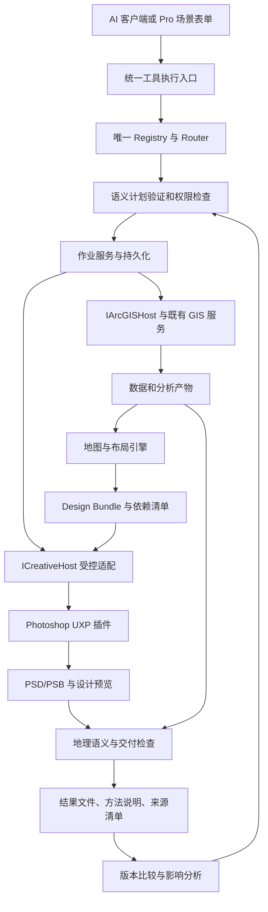

# ArcGIS Pro MCP：创新与产品方案 V4

日期：2026-09-27。状态：**设计建议 / 未实施 / 待正式分批派工**。

本轮响应用户“再次深入完善创新计划、方案和开发计划，同时告诉我每个模块怎么实现”。继承两个要求：数量与质量都提升；通用 GIS→Photoshop 链路先行，同时覆盖规划汇报与科研制图；全部功能完善并验收后才制作统一一键包。

本文与《模块实现设计 V4》《开发执行计划 V4》组成完整方案。V2 的工具候选和首波规格继续作输入；V3 的安装后置原则继续有效。本文不改现役工单、不自动授权产品开发、真实安装、GIS 写入或公开发布。外部顾问简报中的任务书是参考材料，不是新增执行授权。

## 1. 再次评审后的核心决定

产品定位为：**可以解释、复核和更新的 GIS 成果生产插件**。用户可以从自然语言或场景表单进入，同一套执行内核完成数据准备、分析、地图、PS 精修和交付。

不把“更多按钮”“能调用 PS”“有审计日志”单独宣传为独创。核心竞争力是四件事共同成立：

1. **能力广度可证明**：足够多、语义独立、真实可用的 GIS 与设计工具，并能解决完整场景。
2. **结果正确可解释**：每个指标、颜色分类、空间方法有数据和方法依据；未知条件明确显示。
3. **人工设计可保留**：数据刷新不丢人工排版，冲突逐项可见，不能判定的变化不强行合并。
4. **交付后仍能更新**：成果附带数据、方法、版式、设计绑定和依赖信息，下一期能从原成果继续。

### 1.1 本轮源码核对与 V3 修正

| 现场读取项 | 观察 | 对新方案的影响 |
|---|---|---|
| `Composition.cs` | 154 个 `registry.Register(new …)` 调用 | 是静态计数，不冒充安装位或 LIVE 数量 |
| `ErrorCodes.cs` / `gp-whitelist.json` | 33 个错误码常量 / 53 条 GP 项 | 新原因优先放结构化 details；扩展另审 |
| `FolderWorkflowTools.cs` | 作业状态、所有者、断点和执行逻辑集中；内层有直接 `tool.ExecuteAsync(sub)` | 先抽离执行公共入口并证明策略等价，不能仅给新 UI 增加守卫 |
| `MCPToolRouter.cs` | 只读策略门在参数验证前；负责上下文和结果包装 | 新的单工具、批处理、作业与面板必须共享关键守卫顺序 |
| 工具命名 | 源码示例为 `scan_data_folder` | 简报 camelCase 说明不能覆盖源码；既有名不改，别名只用于检索 |
| `ArcGISProMCP.Current/README.md` | 仅占位，没有可构建 Current 项目 | V3 的版本模块描述需收紧：不把该目录当现有 net8 宿主；核实际构建脚本和证据 |
| `Compatibility.csproj` / `Config.daml` | 源项目 net6/WPF；当前是 MCP 按钮入口 | 面板是新增开发；源码 TFM 不等于双代分发和运行能力 |
| `HttpMcpTransport.cs` | 当前只接受指定 MCP 路径的 POST JSON | PS 内部通道需要正式传输设计与兼容测试，不能声称已有路由 |
| D-079 工单 | 文件仍标 ACTIVE，范围冻结 | 新方案排在正式裁定/移交后，不抢占现役执行 |

本轮未重算安装位身份、运行插件数量，也未运行构建、测试或 LIVE。因此只报告上述静态事实，不更新生产基线。

## 2. 把“超越”变成可验收目标

维护者公开文档本轮显示：Knight60/ArcGIS-Pro-MCP 列 112 个命名工具并提供通用 GP/ArcPy；nkarasiak/qgis-mcp 列 125 个工具。这是公开声明，尚未在同一环境独立验证。[ArcGIS 项目](https://github.com/Knight60/ArcGIS-Pro-MCP)、[QGIS 项目](https://github.com/nkarasiak/qgis-mcp)。

photoshop-full-mcp 已公开能力门控、UXP 桥接和运行证据审计。因此“有桥接/有证据”属于应达到的工程基线，不能据此宣称原创或全面领先。[项目文档](https://github.com/muhwagwa0112/photoshop-full-mcp)。

### 2.1 数量的四本账

| 账本 | 定义 | 目标 |
|---|---|---|
| 命名工具 | 唯一注册中心中的独立命名契约 | 原方案 154→175→210→240，其中最终 GIS/工作流 220、PS 20 |
| 独立能力 | 按任务语义去重，合并别名、参数变体、同算法包装 | 冻结对标矩阵后逐项补缺，不用包装数量冒充算法数量 |
| 当前可用能力 | 特定主程序版本、许可、连接状态下已验证可执行的能力 | 面板展示真实数；条件缺失、未测、实验分列 |
| 完整成果 | 有真实输入、验收结果和重跑证据的场景与模板 | 30 条配方、20 套模板（规划 10 / 科研 10） |

GP 白名单 53→100→150 单独计数，不与工具、模板相加。可发现但不可执行的 GP 项不计受控可用项。

**240 是当前基准开发范围，不是自动满足全面超越的证明，也不是上限。** 前置对标包必须冻结仓库 commit/tag、功能矩阵和日期。若发现既定范围没有覆盖的关键能力，例如 3D/时序、特定数据互通或出版能力，形成 Q-DELTA 补差单：明确工具、模块、许可、开发量与测试；经范围裁定并入开发计划、重算数量与工期。缺口未处理前，不使用“全面超过全部开源项目”的结论。

不能用受控 150 项 GP 声称超过竞品任意脚本的理论表达能力。应比较指定范围内**无需用户写代码、经过验证、有清晰契约的任务覆盖**，另外披露开放脚本与受控工具的差异。

### 2.2 质量与体验的竞争标准

- 同一数据、任务定义、宿主条件、模型/提示预算和人工干预预算；跨 QGIS/Pro 的算法差异要披露，不能只比较调用成功。
- 24 个核心任务 × 至少 3 次，另加 5 个冻结后的隐藏变体；所有声称支持的工具、30 配方和20模板另有覆盖证据，不能用 24 例代替全覆盖。
- 分别计算成功率、空间/数值正确率、人工修正次数、操作时间、运行时间、更新复用率和设计保留率；失败样本计入，环境阻断单列。
- 核心任务总完成率目标 ≥95%；关键数据破坏、坐标/单位/图例含义错误为零容忍。总体平均分不能抵消关键失败。
- 在选定竞品共同支持的任务上，目标成功率不低于最佳对照；配对任务的人工操作中位数目标减少 ≥30%，端到端中位时间目标减少 ≥20%。这些是待测目标，必须报告样本量和离散程度，不能现在宣传已达成。
- 可用性试测至少 5 名目标用户属于形成性验证；不据此做普遍统计结论。正式宣传若涉及稳定领先，需要更大、独立的样本。

## 3. 七项可落地的创新

| 创新 | 用户可见价值 | 实现机制 | 首次落点 | 明确边界 |
|---|---|---|---|---|
| 语义化任务计划 | 先辨明“500 米步行”与“500 米直线” | 数据语义契约＋模板匹配＋确定性验证器；AI 只提出候选计划 | M1 | 缺路网不自动替换成缓冲区 |
| 分析与设计依赖图 | 知道换数据会影响哪些图、数字、说明 | 同时记录执行 DAG 和成果依赖；节点保存输入、算法、样式版本 | M1 基础，M2 完整 | 指纹不可靠时保守重算，不保证任意数据自动增量 |
| 地理语义保护 | PS 美化后比例、北向、分类含义仍有保障 | Geometry/QuantitativeColor/LinkedDecoration 三类规则＋绑定校验 | M1 | 不允许自由扭曲地图后保留旧比例尺 |
| 数据更新与人工设计合并 | 更新数据保留用户标题、标识和排版 | 稳定语义 ID＋上次基线/用户现状/新内容三方比较 | M1 初版，M2 强化 | 不承诺自动理解并合并任意手工像素编辑 |
| 有约束的版式候选 | 一次得到适合汇报、科研的有限候选 | 设计 token＋确定性排版规则＋低分辨率预览评分 | M1 规则，M2 候选排序 | 不先做训练模型；视觉评分不等于科学有效性 |
| 数字与图件同源 | 数据更新后图例、指标、方法说明同步 | 指标事实表＋单位/舍入规则＋可绑定文本；未知叙述不生成 | M1 简版，M2 完整 | 用户自行改成自由文本后需显示失去自动绑定 |
| 可恢复的跨软件任务 | PS 关闭或保存失败后可继续 | 持久化状态＋副作用日志＋分步骤确认＋受控补偿 | M1 | GIS 与 PS 不具备一个全局原子事务；未知执行结果先核对 |

创新完成标志不是增加接口名，而是能演示“首次产出→人工改稿→换数据→指出冲突→交付新版”的连续过程。

## 4. 总体架构

图中的接口/服务为拟议职责，不能解释为全部已存在。Registry 仍只在 `Composition.BuildRegistry()` 装配；PS 插件内部命令分发表不是第二 MCP 工具注册中心，也不对外接收任意脚本。

### 4.1 技术取舍

- **保留现有 C# 分层**：Core 放无宿主契约；Tools 放薄工具适配；Compatibility 放 SDK 实现与 WPF 面板。逻辑模块先用目录/namespace 分隔，不为了图好看立即增加20个程序集。
- **Pro 原生面板**：WPF/MVVM＋DAML，与已有插件同进程；交互通过统一执行入口，不在 ViewModel 直接跑 GIS。[Esri 框架资料](https://github.com/Esri/arcgis-pro-sdk/wiki/ProConcepts-Framework)。
- **AI 继续来自现有客户端**：第一版不新建模型网关、不强制新增 API Key，不把所有数据送外部模型。Pro 场景表单无需模型即可运行已验配方。
- **计划可解释且可执行**：自然语言只负责意图候选；最终执行确定性类型检查、单位检查、许可检查和输出检查。没有获准能力就明确缺口。
- **PS 选择 UXP/TypeScript**：先用 DOM，确需时使用内部白名单 action descriptors；修改进入 `executeAsModal`。不把 raw batchPlay、JSX 或代码字符串暴露给模型。[Adobe DOM/batchPlay](https://developer.adobe.com/photoshop/uxp/ps_reference/media/batchplay/)、[模态执行](https://developer.adobe.com/photoshop/uxp/2022/ps-reference/media/executeasmodal)。
- **作业格式渐进升级**：先承接 D-079 最终格式，迁移旧 checkpoint，再引入版本化 journal/manifest。暂不强制引入数据库服务或 Redis。
- **协议保守兼容**：自有作业服务独立于 MCP 协议版本。以已验客户端协议为基础，Tasks/通知/分页分别能力协商；不能把旧实验 Tasks 当长期稳定契约。官方后续版本说明已提出 Tasks 生命周期调整，应在实施时冻结实际版本。[MCP 变更说明](https://blog.modelcontextprotocol.io/posts/2026-07-28-release-candidate/)。

## 5. 用户操作与明显区别

### 5.1 首次任务

1. 用户选择资料文件夹及成果类型，或者对 AI 说“做公共设施覆盖分析，生成规划展板和科研插图，保留 PS 编辑能力”。
2. 系统展示数据体检，只追问会影响结论的问题：设施类别、直线/路网、时间、覆盖率分母；常规默认值在计划中可见。
3. 展示处理步骤、实际输出目录、将新增/修改的对象及未解决条件。用户批准这个明确范围；参数或输入发生实质变化则更新计划。
4. 开始分析。任务面板显示阶段、已完成项、当前步骤、可取消性；有可靠历史才给预计剩余时间。
5. 展示规划与科研候选预览；用户选择并调整颜色、字号、图例和版式。选择模板不会改变分析方法。
6. 在已配对 PS 中打开分层文档；GIS 内容、关联整饰、人工设计各有清晰分组。标题可编辑，地图分层的实际可编辑粒度按支持表显示。
7. 导出地图、可编辑母版、结果数据和方法/来源清单；检查通过才标“可交付”，未验证项不会被绿色成功状态掩盖。

### 5.2 下一期更新

用户选择原任务并换入新数据 → 显示受影响的分析/地图/指标 → 重算必要步骤 → 预览设计变化 → 自动保留没有冲突的人工内容 → 对冲突选择保留人工版、采用新版或另存分支 → 检查并交付。

第一版仅支持完整、可识别的受控组刷新；后续扩大到更细粒度绑定。PS 中手工修改地图像素、打散受控组、复制导致身份不唯一时，要另存候选或人工处理，不能用相同图层名猜测归属。

### 5.3 两类模板共享什么、分别做什么

| 项目 | 规划汇报 | 科研制图 |
|---|---|---|
| 共用 | 相同数据/作业/绑定/来源/刷新内核 | 相同数据/作业/绑定/来源/刷新内核 |
| 信息组织 | 项目概况、指标、方案对比、说明与标识 | 方法、分类、统计显著性、误差、面板编号 |
| 视觉重点 | 阅读层次、展板空间、统一机构风格 | 精确尺寸、字号、色域、跨图分类一致 |
| 强约束 | 面积/覆盖率和图面数据一致 | 分类/统计方法/不确定性真实，不用美化制造结论 |
| 可选装饰 | 有来源的插图、图标、背景素材 | 原则上少装饰；科学内容不使用生成填充修改 |

生成式装饰素材仅作为以后显式启用的可选来源，限装饰区并标明来源；不是本次全链路成立的依赖，也不得用于伪造 GIS 数据、遥感像元或显著性。

## 6. 开发顺序与范围控制

**先识别致命风险，再做垂直闭环，再扩能力，最后做统一安装。**

| 阶段 | 核心产出 | 工具数口径 |
|---|---|---|
| 前置 F | 基线、对标、公共执行契约、PS 通信/分层/刷新技术验证、已知答案样例 | 不新增正式工具 |
| M1 | 第一条可重复且可更新的 GIS→PS 链；6模板 | B1–B4 新增21，目标175 |
| M2 | 质量治理、PS 深度操作、三方刷新强化、16模板 | P1–P4/P10–P12 新增35，目标210 |
| M3 | 专业空间/栅格/出版/互通、30场景、20模板 | P5–P9 新增30，基准目标240 |
| Q-DELTA | 前置冻结对标差额后纳入相应阶段，不能临到最后才补 | 另列数量、成本与证据，不计入原86 |
| Q | 全工具、场景、视觉、性能、兼容、恢复、用户体验验收 | 源码/运行/当前可用数逐表对齐 |
| R | 功能门通过后实现安装器扩展、制候选包、验证部署与恢复 | `.esriAddInX`＋可选`.ccx`，统一入口 |

无需换掉已验底座，不以大规模重写作为创新；先抽取公共服务并用旧测试保护行为，然后逐批接新能力。完整批次与依赖见配套开发计划。

## 7. 当前必须先证明的五个难点

| 难点 | 验证方式 | 不通过时处理 |
|---|---|---|
| PS 受控通信与目录权限 | 实际 PS 版本握手、插件关闭/重开、目录 token 失效、超时 | 改适配设计或限定版本；不能自动退到任意脚本 |
| 分层导出与配准 | 共同画布/地图框，透明度、标签、混合效果、多框样本和锚点误差 | 把必须一起渲染的对象合为组；如需平面降级则明确不可编辑范围 |
| 保存后重新识别图层 | PSD/PSB 重开、复制/重命名/删除组、侧车丢失 | 标冲突或要求重新绑定，不猜测自动覆盖 |
| 作业中断与未知副作用 | 在写前/宿主写后/回执前注入中断 | 对账实际输出；无法证明完成的步骤进入需核对态，不盲重试 |
| 客户端兼容与长期任务 | 原有客户端发现、调用、长任务/重连、取消测试 | 保留已验轮询路径，新协议支持独立适配 |

## 8. 一键安装承诺保持不变

继续采用 ArcGIS Pro 主插件和 Photoshop 配套插件。最终用户使用一个安装向导，选择 GIS 或 GIS＋PS；不要求开发 SDK/Visual Studio/UDT。Adobe 官方支持 CCX 与 UPIA，但权限确认和宿主行为必须实测，不提前保证全程静默。[Adobe 安装说明](https://developer.adobe.com/uxp/guides/how-to/distribution/install/)。

开发期间只形成必要的内部构建与验证载体；**功能验收全部通过 → 最后制作统一一键候选包 → 用实际候选验证安装/升级/恢复 → 最终交付**。

项目临时/素材/日志仍落 D 盘。PS 与官方安装器自身的系统目录、首选项、暂存行为不能凭规划保证完全不写 C 盘；未来实测与安装需要明确例外范围，本轮不执行也不默认批准。

## 9. 配套文档

- [逐模块实现设计 V4](GIS_TO_DESIGN_MODULE_IMPLEMENTATION_V4_20260927.md)：20模块、契约、数据结构、执行/刷新算法和验收。
- [开发执行计划 V4](GIS_TO_DESIGN_DEVELOPMENT_PLAN_V4_20260927.md)：工作包、依赖、各里程碑退出条件和竞争基准。
- [首波工具规格](GIS_TO_DESIGN_TOOL_SPECS_20260927.md)：21候选接口。
- [后续能力清单 V2](GIS_TO_DESIGN_CAPABILITY_BACKLOG_V2_20260927.md)：65候选、场景与模板。
- [V3 计划](GIS_TO_DESIGN_DEVELOPMENT_PLAN_V3_20260927.md)：保留原历史版本；本文所述修正适用于新方案设计，不改其历史记录。
