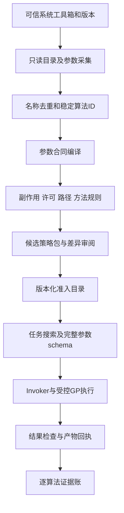

# GP全量自动适配与数量超越计划

日期：2026-10-01。状态：**用户数量目标对应的设计候选；不是白名单扩容实施或2100项已验证声明。** 配套[最终方案](GIS_AUTOMATION_FINAL_PLAN_20261001.md)。

## 1. 本轮新增目标

用户明确要求：GeoAIChat宣称1900+ GP零适配即达，我们也要在核心工具数量和覆盖面全面超越。

因此，不能继续只围绕285个业务入口或53/75个GP白名单做路线。增加一个独立的**GP全量自动适配工程**：通过可信本机元数据生成调用合同，减少逐工具开发，并使发现、检索、许可、预检、受控执行、证据和结果交付形成闭环。

“零适配”在本方案中指**大多数标准工具无需新增手写包装类**；不代表零许可、零数据准备、零方法知识、零策略审查或零测试。现行53白名单、本机服务和285契约本轮不改。

## 2. 数量目标：按相同口径真正超过

设对照冻结版本去重后的有效可调用GP操作数为N。GP包括分析算法、转换、建库和数据管理，不都属于数学算法；独立语义能力另表复核。以下数量以规范化GP操作为口径，名称别名、参数变体、同操作多个入口不重复计数。先取得目录与前提，不能把“1900+”误认成精确1900。

| 指标 | 规划目标 | 计数与达成条件 |
|---|---|---|
| 本机系统GP发现 | 可信Esri工具箱全集100%枚举，目标规模2100+ | 宿主/工具箱/版本/hash固定，别名和旧新命名去重；实际全集不足时如实记录 |
| 元数据/参数合同 | 所有发现项都有合同或明确unsupported原因；完整合同编译率目标≥95% | 分母固定为可信全集去重操作数，分子为全部参数及必要动态条件正确编译项；另报参数实例覆盖率/无需手写包装比例/unsupported，部分schema不算完整适配 |
| 准入后可调用独立GP操作 | **目标≥max(2100, ceil(1.10×N))** | 参数编译、类型/路径/副作用策略、版本/许可条件和逐项真实合法正例/结果断言/关键负例满足；不把仅发现、缺许可或拒绝执行项算可调用 |
| 同条件覆盖 | 对照目标GP集合中本项目有效覆盖100% | 发布前逐行核验；有实际缺口不能宣称该范围全面超越 |
| 自动适配效率 | 标准支持类型无需逐工具手写类；新版本diff自动生成 | 人工只处理特殊类型、风险/方法规则和证据缺口，不逐项重抄schema |
| 用户使用 | 搜索→参数/方法卡→预检→任务范围确认→执行→成果 | 0次用户手写Python；许可或依赖缺失提前解释 |

若N恰为1900，110%为2090，2100目标更高；若N大于1900，目标随确证N提高。目录2100只是发现规模，不自动满足可调用2100目标。

**同一Pro版本、同一工具箱和许可下，两产品可能访问相同Esri算法全集。** 不能靠更多入口让这一全集变大。超过同条件可用数量需要真实纳入对照未覆盖的系统算法或经审核的独立扩展算法；若全集完全相同，只能报告此维度持平，并分别证明产品/质量优势。额外引擎、算法包或自有GP工具箱要列独立来源、许可与实现门，不把模型流程、模板、别名当新增算法。

## 3. 可验证的官方技术基础

ArcPy `ListTools`提供工具枚举；`GetParameterInfo(tool_name)`返回指定工具的参数对象，工具箱别名用于解名冲突。Parameter提供类型、方向、必需/可选/派生、多值、过滤器和依赖等信息。[ListTools](https://pro.arcgis.com/en/pro-app/3.5/arcpy/functions/listtools.htm)、[GetParameterInfo](https://pro.arcgis.com/en/pro-app/3.5/arcpy/functions/getparameterinfo.htm)、[Parameter](https://pro.arcgis.com/en/pro-app/3.5/arcpy/classes/parameter.htm)

这支持元数据驱动设计，但静态Parameter未必完整表达动态必填、输入依赖、方法适用或副作用。许可也可能由级别、扩展或某些参数共同限制。[官方GP许可说明](https://doc.esri.com/en/arcgis-pro/latest/tool-reference/main/geoprocessing-toolbox-licensing.html)

本轮仅核对文档，不运行ListTools、本机GP或许可切换。实际工具数、参数覆盖率、复杂类型与执行路径在GA00验证，API/宿主细节仍需真实Spike。

## 4. 自动适配流水线

目录采集通过现Python Bridge增加经过审查的有限只读metadata操作，或经核实的SDK元数据接口；不接收Python源码、toolbox任意路径或eval表达式。执行优先复用现GP Host有类型调用。SDK接入仍在Compatibility/MCT规则内，非SDK元数据/纯编译放Shared。

## 5. GA00–GA07怎么实现

| 包 | 实现与产物 | 验收 |
|---|---|---|
| GA00 本机全集与对照冻结 | 实际ListTools/工具箱清单；来源、版本、系统/自定义类型、许可前提；对照N目录或尚未取得的证据状态 | 别名/过时名/重复操作扣除；当前53/22候选映射；不把未知N变精确1900 |
| GA01 目录快照 | GpCatalogSnapshot、AlgorithmId、参数快照、来源hash、采集时间；读取Esri可信系统集合 | 不导入或执行用户未知pyt/脚本工具箱；部分失败逐项记录；升级可diff |
| GA02 参数编译 | GpParameterContract/CodecRegistry，生成JSON Schema和参数表单；处理标量、枚举、多值、值表、范围、字段、空间参考、线性单位 | parameter index/order正确；required/optional/derived、composite/动态条件有负例；不支持类型拒绝 |
| GA03 策略编译与准入 | GpAdmissionPolicy按工具/参数/版本指定effects、修改输入、输出、表达式/外发/费用、许可与恢复；批量生成候选策略并审阅 | 参数方向不能独自决定读写；未知副作用不默认只读或安全；发布策略hash与嵌入资源一致 |
| GA04 通用执行与结果 | GpInvocationEnvelope传algorithmId、catalogDigest、typedArgs、approvedScope；现Invoker/GP Host统一审计/取消/产物核对 | 不拼接Python或shell；不能凭字符串导入任意工具；失败与未知副作用可对账 |
| GA05 发现与可选接口 | 按任务检索目录，提供当前支持/许可与方法卡；保留旧list/describe/run白名单语义，新增全目录scope/版本或独立metadata视图走SC02评审 | 模型只读取候选工具小集合，不把2000schema每轮塞入上下文；未准入目录不得混入旧可执行列表 |
| GA06 分层执行证据 | 通用codec覆盖＋按算法已知输入/负例/许可测试；样本生成、资源上限与结果断言可复用 | 样本按工具箱/类型/副作用/许可分层，但可调用宣传数只计逐项有证项；复杂业务仍需E2E |
| GA07 升级和扩展 | Pro版本/工具箱/许可变化触发diff；新增/变化项待审；经批准的独立扩展工具箱另表 | 不自动扩大白名单或信任新工具；旧任务绑定旧合同；不重复计组合流程为算法 |

## 6. 参数编译的关键处理

- `GPString/Boolean/Long/Double`等基础类型按真正约束处理，enum/range不丢失。
- 图层/数据路径为对象引用或拥有根路径；字段参数绑定对应输入schema，而非任意字段名。
- Linear Unit/空间参考/范围采用结构化输入和明确单位，序列化给GP时保持本机规定语义。
- 多值和ValueTable按列类型编码，禁止使用任意字符串拆分拼接替代结构。
- Derived输出通常不是用户输入；“没有out参数”不证明没有修改原数据。
- 动态必填、输入依赖和条件过滤通过专门adapter/规则覆盖；未覆盖时标partial/unsupported，不假装JSON Schema已经完备。
- 表达式/计算字段/SQL/外部URL/工具箱路径/代码块等高风险类型独立策略。需要任意Python代码的模式拒绝；可提供有类型、固定算子的受限替代。
- 读写metadata采集和工具执行隔离；即便只读schema采集也不能加载未知pyt触发不受控验证代码。

现GP序列化主要依赖字符串及分隔符处理，不足以承载全量ValueTable、多值/复合、FieldMap与包含空格/分号/引号的值。GA02先实现类型化codec，再开规模准入；不能复用简单split后宣称任意GP零适配。

每次调用产生有效环境快照：workspace、scratchWorkspace、overwriteOutput、mask、extent、CRS等显式绑定，不继承未批准的工程/上次任务状态。原位输入、Derived输出、目录侧车及中间产物均进入作用范围；无法确定写入范围的模式不得自动准入。并发任务隔离环境，结束/取消核对恢复；宿主实际临时落物也验证，不以改系统TEMP规避D盘边界。

## 7. 53白名单如何升级为大规模受控策略

原53项作为兼容锚，新增规则分批审查，但不要求为每个工具新写C#类。产物为版本化、逐名可核验的准入包；可用家族规则生成候选条目，最终条目仍可追溯到具体工具/参数签名。

通用低风险类型复用codec；修改输入、DDL/删除、外部服务/费用、表达式、未知effects等进入专门规则。批量准入依据来源/版本、schema、effects、许可、路径与恢复，不依据名称像“只读”。新目录可发现不等于可执行。

旧的 `run_geoprocessing` 合同与嵌入白名单行为不能静默破坏；扩容或新策略机制作为明确schema/安全ADR变更审查。环境变量覆盖不能替代正式准入。当前G-222的22项候选有既有流程，本包可以复用其证据，不在规划阶段直接写53→2100。

特别是现 `list_geoprocessing_tools` 明确承诺白名单外永不出现。全量metadata先建内部目录；对外增加发现scope/版本或单独目录视图须正式裁定，不能把未准入工具悄悄放进原工具列表。

写类GP必须先取得持久化intent成功回执，失败则零宿主执行；执行已发生而receipt落盘失败进入待对账，保留产物、不报完整成功、不盲重试。必需输出或内容断言缺失必须阻断完整成功；存在性Unknown不能当不存在放行。现路径/输出/审计warning行为需要GA04明确升级，不能把警告降为绿色完成。

## 8. MCP接口数量怎样也能扩展

默认compact暴露原GP目录/描述/执行入口；真实独立算法数量记在GP能力账。

若需要兼容偏好细粒度工具的客户端，可增加**可选granular模式**：只在 `Composition.BuildRegistry()` 构建时，从固定、已准入快照注册metadata生成的 `gp__...`适配工具；所有动作仍经同一个Invoker和策略。不在请求期间添加第二注册中心，不做未审查热注册。

每个生成入口必须绑定准入manifest中的effects分类与版本；缺分类、版本不符或条件effects无法确定时拒绝执行。不能因名称不在现285分类表中就通过只读门。compact、granular、旧run直调对同算法/参数必须产生相同策略结论，旧入口不能绕过新策略。

两模式操作覆盖相同，公开接口数不同。稳定业务名册285与GP生成入口分别记录；与现专用工具重叠、Esri别名和旧新命名分别扣除。不得宣传“285＋2100＝2385种独立功能”。

granular模式schema和计数由生成manifest↔Composition构建结果↔运行tools/list对账；不能继续仅数源码Register调用行作为生成入口数量。支持分页/发现通知等协议能力需按客户端实际版本验证；首版可固定启动模式和snapshot，避免工具目录在会话中无提示变化。

## 9. 发布前的规模、质量与证据门

G-GP-DISCOVERY：本机可信全集完整枚举、去重、来源和参数采集；缺项清楚。

G-GP-ADAPTER：完整合同编译率≥95%，分母为全部冻结发现操作，分子为全参数/必要动态条件正确编译项；剩余项有专门adapter或明确限制，不缩分母；基础codec与特殊值表/复合/动态参数正负例全过。

G-GP-EXECUTION：目标≥max(2100, ceil(1.10×N))的独立GP操作具有明确准入、运行/许可条件和逐项证据。每项在声明参考环境至少完成一个真实合法正例并核验结果/产物，绑定输入、参数、宿主、许可、策略和断言，并有关键负例；正确拒绝/缺许可、mock、只读schema或同族代表样例不能替代该正例。少量代表工具成功不能扩大成全体成功。未满足数量目标如实报告缺口和资源，补强后再宣称覆盖超越。

G-GP-QUALITY：高频业务结合60场景实际输出和科学检查，错误参数、许可、危险表达式、非拥有输出、取消/超时/修改输入/重复调用负例通过。未知项和失败不从分母移走。

目录规模和适配通道可在早期取得结果，2100逐算法正负例/许可/数据验证是大工程，单独估工，不用自动schema生成抹掉测试投入。

## 10. 开发计划与范围边界

GA00–GA02作为优先验证与基础；GA03/GA04在实际受控执行前完成；GA05并入U01/U02/U05/U06；GA06/GA07持续随算法域推进。与PS和产品包在现四线写权窗口内分工，不新设第五线或自动派D工单。

两周最小试验先选6类参数、至少3个工具箱和30–50个算法，证明无需手写包装的目录→参数→执行链；同时记录未支持类型和真实本机总数。**试验不代表2100项已经完成。** 之后根据实际新类型/高风险/许可和每项证据成本更新工期、机器与数据预算。

本方案不会把安全约束作为永远只支持53的理由，也不会把全量目录当全量正确执行。通过可复用的类型、规则和测试基座扩大规模，才同时实现数量和质量目标。
